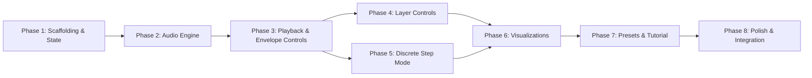

# Klangtreppe — Implementation Plan

**Version:** 1.0
**Date:** 2026-03-02
**Status:** Draft
**Based on:** [PRD v1.0](./PRD.md), [Technical Spec v1.0](./TECHNICAL-SPEC.md)

---

## Table of Contents

1. [Overview](#1-overview)
2. [Phase 1: Project Scaffolding & State Management](#2-phase-1-project-scaffolding--state-management)
3. [Phase 2: Audio Engine Core](#3-phase-2-audio-engine-core)
4. [Phase 3: Playback & Envelope Controls](#4-phase-3-playback--envelope-controls)
5. [Phase 4: Layer Controls](#5-phase-4-layer-controls)
6. [Phase 5: Discrete Step Mode](#6-phase-5-discrete-step-mode)
7. [Phase 6: Visualizations](#7-phase-6-visualizations)
8. [Phase 7: Presets & Tutorial](#8-phase-7-presets--tutorial)
9. [Phase 8: Polish & Integration](#9-phase-8-polish--integration)

---

## 1. Overview

This document provides a step-by-step implementation plan for the Klangtreppe application. Each phase produces a working (if incomplete) application and can be handed to a developer as a self-contained work package.

### Implementation Principles

- **Incremental delivery:** Each phase builds on the previous and produces a testable result.
- **No build tools:** All files are vanilla HTML, CSS, and JS (ES6 modules). Serve with any static file server.
- **Single source of truth:** All state flows through `js/state.js`. No module maintains shadow state.
- **Event-driven:** State changes emit events; modules subscribe. The scheduler and animation loops read state each tick by design.

### Dependency Graph Between Phases



---

## 2. Phase 1: Project Scaffolding & State Management

### Goal

Create the complete file structure, implement the foundational modules (`constants.js`, `utils.js`, `state.js`), build the HTML shell with CSS layout, and verify that the page loads with a working state system accessible from the browser console.

### Dependencies

None — this is the starting phase.

### Files to Create

| File | Action |
|------|--------|
| [`index.html`](../index.html) | Create — full HTML structure with all semantic elements |
| [`styles/main.css`](../styles/main.css) | Create — complete stylesheet with custom properties, grid layout, dark theme |
| [`js/constants.js`](../js/constants.js) | Create — all shared constants |
| [`js/utils.js`](../js/utils.js) | Create — all utility functions |
| [`js/state.js`](../js/state.js) | Create — central state store with event emitter |
| [`js/main.js`](../js/main.js) | Create — bootstrap stub |

### Step-by-Step Implementation

#### Step 1.1: Create `js/constants.js`

Implement all shared constants as specified in [Technical Spec §3.1](./TECHNICAL-SPEC.md).

**Exports to implement:**

```javascript
export const LAYER_COLORS = [
  '#E69F00', '#56B4E9', '#009E73', '#F0E442',
  '#0072B2', '#D55E00', '#CC79A7', '#999999',
];

export const THEME = {
  background: '#1a1a2e',
  vizBackground: '#16213e',
  accent: '#f0a500',
  text: '#e0e0e0',
  textMuted: '#8888aa',
  controlBg: '#1f1f3a',
  controlBorder: '#2a2a4a',
  envelopeFill: 'rgba(240, 165, 0, 0.15)',
  envelopeStroke: 'rgba(240, 165, 0, 0.8)',
  gridLine: 'rgba(255, 255, 255, 0.08)',
  gridLabel: 'rgba(255, 255, 255, 0.4)',
};

export const LIMITS = { /* all values from tech spec §3.1 */ };
export const STEP_INTERVALS = { semitone: 1/12, wholetone: 2/12, minorthird: 3/12 };
export const PITCH_CLASSES = ['C','C♯','D','D♯','E','F','F♯','G','G♯','A','A♯','B'];
```

**Edge cases:**
- Ensure `LIMITS.baseFrequency` is `16.35` (C0 in Hz) — this is the anchor for all frequency calculations.
- `LIMITS.schedulerIntervalMs` must be `20` (not lower, to avoid main thread overload).

#### Step 1.2: Create `js/utils.js`

Implement all pure utility functions as specified in [Technical Spec §3.2](./TECHNICAL-SPEC.md).

**Functions to implement (in this order):**

1. **`log2(x)`** — `Math.log2(x)` wrapper (provides a named export).
2. **`clamp(value, min, max)`** — `Math.min(Math.max(value, min), max)`.
3. **`lerp(a, b, t)`** — `a + (b - a) * t`.
4. **`mapRange(value, inMin, inMax, outMin, outMax)`** — linear mapping between ranges.
5. **`gaussianAmplitude(freq, center, sigma)`** — the core envelope function:
   ```javascript
   export function gaussianAmplitude(freq, center, sigma) {
     const logDist = Math.log2(freq) - Math.log2(center);
     return Math.exp(-0.5 * (logDist / sigma) ** 2);
   }
   ```
6. **`sliderToLogFreq(position, minFreq, maxFreq)`** — converts linear 0–1 slider to log-scale frequency.
7. **`logFreqToSlider(freq, minFreq, maxFreq)`** — inverse of above.
8. **`formatFrequency(hz)`** — returns `"440 Hz"` or `"1.2 kHz"` (threshold at 1000 Hz).
9. **`formatAmplitude(amp)`** — returns `"75%"` (multiply by 100, round to integer).

**Edge cases:**
- `gaussianAmplitude` must handle `freq <= 0` gracefully (return 0).
- `sliderToLogFreq` must handle `position = 0` and `position = 1` exactly (return `minFreq` and `maxFreq`).
- `formatFrequency` must handle very low frequencies (< 1 Hz) and very high (> 20 kHz).

#### Step 1.3: Create `js/state.js`

Implement the central state store as specified in [Technical Spec §3.3](./TECHNICAL-SPEC.md) and [§5](./TECHNICAL-SPEC.md).

**Implementation order:**

1. **Define `DEFAULT_STATE`** (from Tech Spec §5.2):
   ```javascript
   const DEFAULT_STATE = {
     isPlaying: false,
     isFrozen: false,
     direction: 'ascending',
     speed: 0.1,
     masterVolume: 0.5,
     envelopeCenter: 500,
     envelopeWidth: 3.0,
     envelopeEnabled: true,
     layerCount: 6,
     layers: Array.from({ length: 6 }, () => ({
       enabled: true, soloed: false, currentFreq: 0, currentAmp: 0,
     })),
     mode: 'continuous',
     stepInterval: 'semitone',
     stepRate: 1.0,
     pitchOffset: 0.0,
     activeVisualization: 'envelope',
     tutorialStep: null,
     activePreset: 'klassisch',
   };
   ```

2. **Module-scoped `state` variable** — deep clone of `DEFAULT_STATE`.

3. **Module-scoped `subscribers` Map** — `Map<string, Set<Function>>`.

4. **`getState()`** — returns shallow copy: `{ ...state, layers: [...state.layers] }`.

5. **`getStateValue(key)`** — returns `state[key]` directly.

6. **`setState(partial)`**:
   - Iterate `Object.entries(partial)`, detect changed keys (strict inequality `!==`).
   - For `layers` array, always treat as changed if provided.
   - Notify subscribers per changed key, then wildcard subscribers.
   - Wrap each subscriber call in try/catch to prevent one failing subscriber from blocking others.

7. **`subscribe(keys, callback)`**:
   - `keys` is either `'*'` or an array of state key strings.
   - Returns an unsubscribe function.

8. **`updateLayer(index, props)`**:
   - Clone the layers array, merge props into the target layer, call `setState({ layers: newLayers })`.

9. **`resetState()`**:
   - Deep clone `DEFAULT_STATE` into `state`, emit all keys as changed.

**Edge cases:**
- `setState({})` with no changes should be a no-op (no events emitted).
- `subscribe` with an empty array should be a no-op.
- `updateLayer` with an out-of-bounds index should be a no-op.
- Subscribers that throw should not prevent other subscribers from being notified.

#### Step 1.4: Create `index.html`

Build the complete HTML structure as specified in [Technical Spec §7.1](./TECHNICAL-SPEC.md).

**Implementation order:**

1. `<!DOCTYPE html>`, `<html lang="de">`, `<head>` with meta tags, title, CSS link.
2. `<header>` with title, subtitle, tutorial button (`#btn-tutorial`), play button (`#btn-play`).
3. `<main>` with two-column grid:
   - Left: `<section class="viz-area">` with tab nav (`role="tablist"`), canvas container, tutorial overlay (hidden).
   - Right: `<aside class="controls-panel">` with all fieldsets:
     - **Richtung** — direction buttons (`data-direction`), freeze button (`#btn-freeze`).
     - **Geschwindigkeit** — speed slider (`#slider-speed`), output (`#speed-value`).
     - **Hüllkurve** — envelope toggle (`#chk-envelope`), center slider (`#slider-env-center`), width slider (`#slider-env-width`).
     - **Schichten** — layer count slider (`#slider-layers`), layer list container (`#layer-list`).
     - **Modus** — mode buttons (`data-mode`), discrete options div (`#discrete-options`, hidden), interval select (`#select-interval`), step rate slider (`#slider-step-rate`).
4. `<footer>` with preset buttons (`data-preset`), volume slider (`#slider-volume`), share button (`#btn-share`).
5. Hidden tooltip container `<div id="tooltip">`.
6. Hidden screen reader status `<div id="sr-status" class="sr-only" aria-live="polite">`.
7. `<script type="module" src="js/main.js">`.

**All ARIA attributes must be present from the start** — `role`, `aria-label`, `aria-checked`, `aria-pressed`, `aria-selected`, `aria-controls`, `aria-live`, `aria-valuemin`, `aria-valuemax`, `aria-valuenow`. See Tech Spec §12.1 for exact attribute values.

**All `data-*` attributes must be present** — `data-direction`, `data-view`, `data-preset`, `data-mode`, `data-action`, `data-layer`, `data-tooltip`. These are used by JS modules for element selection and event delegation.

#### Step 1.5: Create `styles/main.css`

Build the complete stylesheet as specified in [Technical Spec §7.2](./TECHNICAL-SPEC.md).

**Implementation order:**

1. **CSS custom properties** (`:root` block) — all design tokens from Tech Spec §7.2.
2. **Reset/base styles:** `body` grid layout (`100vh`, `overflow: hidden`), font, colors.
3. **Header styles:** flex layout, title, buttons.
4. **Main grid:** two-column layout (`var(--viz-width)` / `var(--controls-width)`).
5. **Visualization area:** flex column, canvas container (`flex: 1`), tab buttons.
6. **Controls panel:** `overflow-y: auto`, padding, `border-left`, fieldset/legend styles.
7. **Control group styles:** fieldsets, legends, sliders, buttons, toggles, select.
8. **Button styles:** `.btn`, `.btn--primary`, `.btn--secondary`, `.btn--ghost`, `.btn--toggle`, `.btn--icon`, `.btn--preset`, `.btn--active`, `.btn--play`.
9. **Button group styles:** `.btn-group` with radio-button visual pattern.
10. **Slider styles:** custom range input styling for dark theme.
11. **Layer list styles:** `.layer-list`, `.layer-item`, color indicators, amplitude bars.
12. **Footer styles:** flex layout, preset buttons row, volume control.
13. **Tutorial overlay styles:** absolute positioning, backdrop blur, content layout.
14. **Tooltip styles:** positioned, z-index, arrow.
15. **Screen reader only:** `.sr-only` utility class.
16. **Focus styles:** `:focus-visible` with accent outline.
17. **Responsive breakpoints:** `@media (max-width: 1024px)` and `@media (max-width: 768px)`.

**Key layout requirements:**
- Body uses `grid-template-rows: var(--header-height) 1fr var(--footer-height)`.
- Main uses `grid-template-columns: var(--viz-width) var(--controls-width)`.
- Canvas must fill its container: `width: 100%; height: 100%; display: block`.
- Controls panel scrolls internally if content overflows.
- No page-level scrolling (`overflow: hidden` on body).

#### Step 1.6: Create `js/main.js` (Stub)

Create a minimal bootstrap that imports state and exposes it for console testing.

```javascript
import { resetState, getState, setState, subscribe } from './state.js';

document.addEventListener('DOMContentLoaded', () => {
  resetState();

  // Expose state API on window for console testing (Phase 1 only)
  window.__klangtreppe = { getState, setState, subscribe };

  console.log('Klangtreppe initialized. State:', getState());
});
```

### Verification Criteria

1. **Page loads without errors:** Open `index.html` via a local server (e.g., `python3 -m http.server`). No console errors.
2. **Layout renders correctly:** Header, visualization area (with empty canvas), controls sidebar, and footer are all visible within the viewport. No scrollbars on the page.
3. **Dark theme applied:** Background is dark charcoal, text is light gray, accent color visible on buttons.
4. **State system works from console:**
   ```javascript
   __klangtreppe.getState()                    // → full default state
   __klangtreppe.setState({ speed: 0.2 })
   __klangtreppe.getState().speed               // → 0.2
   let unsub = __klangtreppe.subscribe(['speed'], (keys, s) => console.log('Speed:', s.speed))
   __klangtreppe.setState({ speed: 0.3 })       // → logs "Speed: 0.3"
   unsub()
   __klangtreppe.setState({ speed: 0.4 })       // → no log (unsubscribed)
   ```
5. **Responsive layout:** Resize browser to 768px width — layout adapts (controls below visualization on narrow screens).
6. **All HTML elements present:** All buttons, sliders, fieldsets, canvas, and overlay elements exist in the DOM with correct IDs and data attributes.

---

## 3. Phase 2: Audio Engine Core

### Goal

Implement the Web Audio API node graph and the scheduling loop so that clicking the play button produces an ascending Shepard's Tone with Gaussian envelope. This phase delivers the core audio experience.

### Dependencies

Phase 1 must be complete (state system, HTML structure, CSS).

### Files to Create/Modify

| File | Action |
|------|--------|
| [`js/audio-engine.js`](../js/audio-engine.js) | Create — Web Audio node graph management |
| [`js/scheduler.js`](../js/scheduler.js) | Create — pitch scheduling loop |
| [`js/main.js`](../js/main.js) | Modify — wire play button, AudioContext init |

### Step-by-Step Implementation

#### Step 2.1: Create `js/audio-engine.js`

Implement the Web Audio API node graph as specified in [Technical Spec §3.4](./TECHNICAL-SPEC.md) and [§4](./TECHNICAL-SPEC.md).

**Node graph topology:**

```
OscillatorNode 0 → GainNode 0 ─┐
OscillatorNode 1 → GainNode 1 ─┤
OscillatorNode 2 → GainNode 2 ─┤→ GainNode normalizer → GainNode master → AnalyserNode → destination
...                             │
OscillatorNode N → GainNode N ─┘
```

**Implementation order:**

1. **Module-scoped variables:**
   ```javascript
   let audioCtx = null;
   let oscillators = [];
   let layerGains = [];
   let normalizerGain = null;
   let masterGain = null;
   let analyser = null;
   ```

2. **`initAudio()`:**
   - Create `AudioContext` with `webkitAudioContext` fallback.
   - Create the master chain: `normalizerGain → masterGain → analyser → destination`.
   - Configure `AnalyserNode`: `fftSize = 2048`, `smoothingTimeConstant = 0.8`.
   - Set `masterGain.gain.value` to `getState().masterVolume`.
   - Guard: if `audioCtx` already exists, return it (idempotent).
   - Return the `AudioContext`.

3. **`getAudioContext()`** — returns `audioCtx`.

4. **`rebuildLayers(layerCount)`:**
   - Stop and disconnect all existing oscillators and gain nodes.
   - Clear arrays.
   - Create `layerCount` new `OscillatorNode`/`GainNode` pairs.
   - Each oscillator: `type = 'sine'`, connect to its gain node.
   - Each gain node: `gain.value = 0` (silent initially), connect to `normalizerGain`.
   - If oscillators were previously playing, start the new oscillators immediately.

5. **`setLayerFrequency(index, frequency, timeConstant)`:**
   - Guard: return if `index >= oscillators.length` or `!audioCtx`.
   - Clamp frequency to safe range (1 Hz – 22050 Hz).
   - `oscillators[index].frequency.setTargetAtTime(frequency, audioCtx.currentTime, timeConstant)`.

6. **`setLayerGain(index, gain, timeConstant)`:**
   - Guard: return if `index >= layerGains.length` or `!audioCtx`.
   - `layerGains[index].gain.setTargetAtTime(gain, audioCtx.currentTime, timeConstant)`.

7. **`setNormalizerGain(activeCount)`:**
   - `const gain = 1.0 / Math.sqrt(Math.max(activeCount, 1))`.
   - `normalizerGain.gain.setTargetAtTime(gain, audioCtx.currentTime, 0.01)`.

8. **`setMasterVolume(volume)`:**
   - `masterGain.gain.setTargetAtTime(volume, audioCtx.currentTime, 0.01)`.

9. **`startOscillators()`:**
   - Call `osc.start()` on each oscillator.
   - Guard against calling `start()` on already-started oscillators (track with a boolean flag).

10. **`stopOscillators()`:**
    - Call `osc.stop()` on each oscillator, then `osc.disconnect()`.
    - Disconnect all gain nodes.
    - Clear arrays.
    - Note: After `stop()`, `OscillatorNode` cannot be restarted — new nodes must be created.

11. **`getAnalyser()`** — returns `analyser`.

12. **`resumeContext()`** — `if (audioCtx?.state === 'suspended') await audioCtx.resume()`.

13. **`suspendContext()`** — `if (audioCtx?.state === 'running') await audioCtx.suspend()`.

**Edge cases:**
- `initAudio()` must only be called once. Guard with `if (audioCtx) return audioCtx`.
- `rebuildLayers()` must handle being called when no AudioContext exists (no-op).
- `stopOscillators()` must handle empty arrays gracefully.
- `setLayerFrequency` must clamp frequency to avoid Web Audio errors.

#### Step 2.2: Create `js/scheduler.js`

Implement the scheduling loop as specified in [Technical Spec §3.5](./TECHNICAL-SPEC.md) and [§4.2](./TECHNICAL-SPEC.md).

**Implementation order:**

1. **Module-scoped variables:**
   ```javascript
   let intervalId = null;
   let lastTickTime = 0;
   ```

2. **`startScheduler()`:**
   - Set `lastTickTime = getAudioContext().currentTime`.
   - Start `setInterval(tick, LIMITS.schedulerIntervalMs)`.
   - Store the interval ID.

3. **`stopScheduler()`:**
   - `clearInterval(intervalId)`.
   - Set `intervalId = null`.

4. **`isSchedulerRunning()`** — returns `intervalId !== null`.

5. **`tick()`** — the core function (continuous mode only in this phase):
   - Read state via `getState()`.
   - If `!state.isPlaying || state.isFrozen`: return early.
   - Compute `deltaTime = audioCtx.currentTime - lastTickTime`. Clamp to max 0.1s to prevent huge jumps after tab backgrounding.
   - Update `lastTickTime`.
   - Compute direction multiplier: `ascending → +1`, `descending → -1`, `paused → 0`.
   - Advance `pitchOffset += deltaTime * state.speed * directionMultiplier`.
   - Wrap `pitchOffset` to `[0, 1)` using `wrapPitchOffset()`.
   - For each layer `i` from `0` to `state.layerCount - 1`:
     - Compute frequency: `LIMITS.baseFrequency * Math.pow(2, pitchOffset + i)`.
     - Compute envelope amplitude: if `state.envelopeEnabled`, call `gaussianAmplitude(freq, state.envelopeCenter, state.envelopeWidth)`, else `1.0`.
     - Apply mute: if `!state.layers[i].enabled`, set amplitude to `0.0`.
     - Count active layers.
     - Call `setLayerFrequency(i, freq, LIMITS.audioTimeConstant)`.
     - Call `setLayerGain(i, amp, LIMITS.audioTimeConstant)`.
     - Store computed `currentFreq` and `currentAmp` for the layer.
   - Call `setNormalizerGain(activeCount)`.
   - Batch update state: `setState({ pitchOffset, layers: newLayers })`.

6. **`wrapPitchOffset(offset)`:**
   - While `offset >= 1.0`: `offset -= 1.0`.
   - While `offset < 0.0`: `offset += 1.0`.
   - Return `offset`.

**Edge cases:**
- First tick after start: `deltaTime` may be very small or zero — handle gracefully.
- If `deltaTime` is unexpectedly large (tab backgrounded), clamp to 0.1s max.
- Floating point accumulation in `pitchOffset` is handled by the modular wrapping.

#### Step 2.3: Modify `js/main.js` — Wire Play Button

Update the bootstrap to handle AudioContext initialization and play/stop toggling.

```javascript
import { resetState, getState, setState, subscribe } from './state.js';
import { initAudio, resumeContext, rebuildLayers, startOscillators, stopOscillators } from './audio-engine.js';
import { startScheduler, stopScheduler } from './scheduler.js';

let audioInitialized = false;

document.addEventListener('DOMContentLoaded', () => {
  resetState();

  const btnPlay = document.getElementById('btn-play');

  btnPlay.addEventListener('click', async () => {
    if (!audioInitialized) {
      initAudio();
      audioInitialized = true;
    }
    await resumeContext();

    const state = getState();
    if (state.isPlaying) {
      stopScheduler();
      stopOscillators();
      setState({ isPlaying: false });
      btnPlay.textContent = '▶ Abspielen';
      btnPlay.setAttribute('aria-label', 'Abspielen');
    } else {
      rebuildLayers(state.layerCount);
      startOscillators();
      startScheduler();
      setState({ isPlaying: true });
      btnPlay.textContent = '⏹ Stopp';
      btnPlay.setAttribute('aria-label', 'Stopp');
    }
  });
});
```

### Verification Criteria

1. **Play produces sound:** Click the play button → ascending Shepard's Tone is audible with the default 6 layers.
2. **Gaussian envelope is applied:** The tone has a clear "center" — middle frequencies are loudest, extreme highs and lows are quiet.
3. **Seamless looping:** Listen for 30+ seconds — no audible clicks, pops, or discontinuities when layers wrap around.
4. **Stop works cleanly:** Click stop → audio stops immediately with no click or pop.
5. **Play/Stop toggle:** Button text changes between "▶ Abspielen" and "⏹ Stopp".
6. **Console state updates:** While playing, `getState().pitchOffset` changes continuously. `layers[].currentFreq` and `layers[].currentAmp` update.
7. **iOS Safari:** If testing on iOS, the AudioContext resumes correctly after the first tap.

---

## 4. Phase 3: Playback & Envelope Controls

### Goal

Implement two-way binding for all playback controls (direction, speed, freeze, volume) and envelope controls (center, bandwidth, on/off toggle). After this phase, all sidebar controls in the "Richtung", "Geschwindigkeit", and "Hüllkurve" sections are fully functional.

### Dependencies

Phase 2 must be complete (audio engine and scheduler running).

### Files to Create/Modify

| File | Action |
|------|--------|
| [`js/ui/controls.js`](../js/ui/controls.js) | Create — all control bindings |
| [`js/main.js`](../js/main.js) | Modify — import and initialize controls |

### Step-by-Step Implementation

#### Step 3.1: Create `js/ui/controls.js`

Implement the control binding module as specified in [Technical Spec §3.14](./TECHNICAL-SPEC.md) and [§7.3](./TECHNICAL-SPEC.md).

**Export:** Single `initControls()` function that calls all setup functions below.

**Two-way binding pattern (applied to all controls):**

```
User drags slider → input event → setState() → subscriber fires → update DOM
                                              → scheduler reads new value on next tick
```

**Implementation order:**

1. **Direction buttons** (`[data-direction]` attribute):
   - Query all `[data-direction]` buttons.
   - On click: `setState({ direction: button.dataset.direction })`.
   - Subscribe to `['direction']`: update `aria-checked` on all direction buttons (clicked → `"true"`, others → `"false"`), add/remove `.btn--active` class.

2. **Freeze button** (`#btn-freeze`):
   - On click: `setState({ isFrozen: !getState().isFrozen })`.
   - Subscribe to `['isFrozen']`: update `aria-pressed`, toggle `.btn--active` class, update button text.

3. **Speed slider** (`#slider-speed`):
   - Slider uses linear 0–1 range mapped to `LIMITS.minSpeed`–`LIMITS.maxSpeed`.
   - On `input`: convert slider value to speed using `mapRange()`, call `setState({ speed })`.
   - Subscribe to `['speed']`: convert speed back to slider position, update `slider.value` and `#speed-value` output text (`"0.10 Okt/s"`).
   - Update `aria-valuenow` and `aria-valuetext`.

4. **Envelope toggle** (`#chk-envelope`):
   - On `change`: `setState({ envelopeEnabled: checkbox.checked })`.
   - Subscribe to `['envelopeEnabled']`: update `checkbox.checked`.

5. **Envelope center slider** (`#slider-env-center`):
   - Uses logarithmic mapping: slider 0–1 → `LIMITS.minEnvelopeCenter`–`LIMITS.maxEnvelopeCenter` via `sliderToLogFreq()`.
   - On `input`: convert to frequency, `setState({ envelopeCenter: freq })`.
   - Subscribe to `['envelopeCenter']`: convert back via `logFreqToSlider()`, update slider and `#env-center-value` output.
   - Update `aria-valuenow` (Hz value) and `aria-valuetext` (formatted string).

6. **Envelope width slider** (`#slider-env-width`):
   - Direct mapping: slider `min=1, max=6, step=0.1` maps directly to octaves.
   - On `input`: `setState({ envelopeWidth: parseFloat(slider.value) })`.
   - Subscribe to `['envelopeWidth']`: update slider and `#env-width-value` output (`"3.0 Okt"`).

7. **Volume slider** (`#slider-volume`):
   - Direct mapping: slider `min=0, max=1, step=0.01`.
   - On `input`: `setState({ masterVolume: parseFloat(slider.value) })`.
   - Subscribe to `['masterVolume']`: update slider value. Also call `setMasterVolume()` from audio-engine.

**Edge cases:**
- Slider `input` events fire rapidly during drag — `setState` must be efficient.
- When `envelopeEnabled` is toggled off, center/width sliders remain at their positions (not disabled).
- Direction change while playing must be smooth — scheduler reads `direction` each tick.
- Freeze while playing: scheduler skips pitch advancement but oscillators sustain at current frequencies.

#### Step 3.2: Modify `js/main.js` — Initialize Controls

Add import and call `initControls()` inside the `DOMContentLoaded` handler, after `resetState()`.

### Verification Criteria

1. **Direction buttons:** Click "↓ Ab" → tone descends. Click "⏸ Halt" → tone holds steady. Click "↑ Auf" → tone ascends. Active button is visually highlighted.
2. **Speed slider:** Drag right → tone glides faster. Drag left → slower. Value display updates in real time.
3. **Freeze button:** Click → tone holds at current pitch. Click again → resumes. Button shows pressed state.
4. **Envelope toggle:** Uncheck → all layers equally loud, octave jumps audible. Check → envelope restored, illusion returns.
5. **Envelope center:** Drag slider → the loudest frequency range shifts audibly.
6. **Envelope width:** Drag narrow → fewer layers audible, illusion weakens. Drag wide → more layers audible.
7. **Volume slider:** Drag → overall volume changes smoothly with no clicks.
8. **State consistency:** After adjusting controls, `getState()` in console reflects all current values.
9. **Two-way binding:** Calling `setState({ speed: 0.3 })` from console updates the speed slider position and value display.

---

## 5. Phase 4: Layer Controls

### Goal

Implement the layer panel with dynamic layer count adjustment, per-layer mute/solo buttons, and real-time frequency/amplitude display. After this phase, students can isolate individual layers to hear the octave jumps — the key deconstruction tool.

### Dependencies

Phase 3 must be complete (controls system, audio engine responding to state).

### Files to Create/Modify

| File | Action |
|------|--------|
| [`js/ui/layers.js`](../js/ui/layers.js) | Create — layer list UI with mute/solo |
| [`js/main.js`](../js/main.js) | Modify — import and initialize layers |

### Step-by-Step Implementation

#### Step 4.1: Create `js/ui/layers.js`

Implement the layer list module as specified in [Technical Spec §3.15](./TECHNICAL-SPEC.md) and [§5.5](./TECHNICAL-SPEC.md).

**Implementation order:**

1. **`initLayers()`** — exported initialization function. Calls `renderLayerList()`, sets up event delegation, subscribes to state.

2. **`renderLayerList()`:**
   - Query `#layer-list` container, clear existing content.
   - For each layer `i` from `0` to `state.layerCount - 1`, create:
     - `.layer-item` div with `role="listitem"`, `data-layer-index`.
     - Color indicator span (background from `LAYER_COLORS[i]`).
     - Name span: `"Schicht ${i + 1}"`.
     - Frequency display: `id="layer-freq-${i}"`.
     - Amplitude bar: outer `.layer-item__amp-bar`, inner `.layer-item__amp-fill` with `id="layer-amp-${i}"`.
     - Solo button: `data-action="solo"`, `data-layer="${i}"`, `aria-label`, `aria-pressed`.
     - Mute button: `data-action="mute"`, `data-layer="${i}"`, `aria-label`, `aria-pressed`.

3. **Event delegation** on `#layer-list`:
   - Listen for `click` on the container.
   - Find clicked button via `event.target.closest('[data-action]')`.
   - Extract `action` and `layerIndex`, dispatch to `handleSolo()` or `handleMute()`.

4. **`handleSolo(layerIndex)`** (from Tech Spec §5.5):
   - If already soloed: un-solo all → `enabled: true, soloed: false` for all layers.
   - If not soloed: solo this one → `enabled: true, soloed: true` for target, `enabled: false, soloed: false` for all others.

5. **`handleMute(layerIndex)`:**
   - Toggle `enabled` on the target layer.
   - If a soloed layer is muted, clear solo state on all layers.

6. **Layer count slider** (`#slider-layers`):
   - On `input`: `setState({ layerCount: parseInt(slider.value) })`.
   - Subscribe to `['layerCount']`: update slider, output display.

7. **Layer count change handler** (subscribe to `['layerCount']`):
   - Resize the `layers` array (add new enabled layers or trim excess).
   - Clear solo state if the soloed layer was removed.
   - Call `rebuildLayers(newCount)` from audio-engine.
   - Re-render the layer list via `renderLayerList()`.

8. **Real-time frequency/amplitude updates** (subscribe to `['layers']`):
   - For each layer, update `#layer-freq-${i}` text with `formatFrequency(layer.currentFreq)`.
   - Update `#layer-amp-${i}` width style with `${(layer.currentAmp * 100).toFixed(0)}%`.
   - Update solo/mute button `aria-pressed` and `.btn--active` class.
   - **Performance note:** These are lightweight DOM updates (text + width) at 50Hz — acceptable.

**Edge cases:**
- Solo + mute interaction: Solo layer 2, then mute layer 2 → solo clears, layer 2 muted, all others re-enabled.
- Layer count decrease while soloed: If soloed layer is removed, clear solo, enable all remaining.
- Layer count increase: New layers are enabled and not soloed.
- All layers muted: normalizer handles `activeCount = 0` gracefully.

#### Step 4.2: Modify `js/main.js`

Add import and call `initLayers()` inside the `DOMContentLoaded` handler.

### Verification Criteria

1. **Layer list renders:** 6 layer items visible with correct color indicators.
2. **Solo works:** Click "S" on Schicht 3 → only layer 3 audible, octave jump clearly heard. Click "S" again → all layers restored.
3. **Mute works:** Click "M" on Schicht 1 → layer 1 silent. Click "M" again → restored.
4. **Solo + mute interaction:** Solo layer 3, then mute layer 3 → solo clears, layer 3 muted, others enabled.
5. **Layer count adjustment:** Drag to 3 → 3 layers, 3 items. Drag to 8 → 8 layers, richer sound.
6. **Frequency display updates:** While playing, each layer's frequency changes in real time.
7. **Amplitude bars animate:** Bars grow/shrink as layers move through the envelope.
8. **Envelope off + solo:** Toggle envelope off, solo a layer → hear constant-volume tone with clear octave jump.

---

## 6. Phase 5: Discrete Step Mode

### Goal

Implement the Shepard Scale mode — discrete pitch steps instead of continuous gliding. Includes the mode toggle, step interval selection, step rate control, and crossfade between steps.

### Dependencies

Phase 3 must be complete (controls system). Phase 4 is recommended but not strictly required.

### Files to Modify

| File | Action |
|------|--------|
| [`js/scheduler.js`](../js/scheduler.js) | Modify — add discrete step tick logic |
| [`js/ui/controls.js`](../js/ui/controls.js) | Modify — add mode toggle, interval select, step rate slider |

### Step-by-Step Implementation

#### Step 5.1: Modify `js/scheduler.js` — Add Discrete Mode

Add the discrete step logic as specified in [Technical Spec §4.2](./TECHNICAL-SPEC.md).

**Implementation:**

1. **Add module-scoped variables:**
   ```javascript
   let lastStepTime = 0;
   let currentStepOffset = 0;
   ```

2. **Modify `tick()` to dispatch based on mode:**
   ```javascript
   function tick() {
     const state = getState();
     if (!state.isPlaying || state.isFrozen) return;
     if (state.mode === 'continuous') {
       tickContinuous(state);
     } else {
       tickDiscrete(state);
     }
   }
   ```

3. **Rename existing tick logic** to `tickContinuous(state)`.

4. **Implement `tickDiscrete(state)`:**
   - Check if enough time has elapsed: `now - lastStepTime >= 1.0 / state.stepRate`.
   - If yes: advance `currentStepOffset` by `STEP_INTERVALS[state.stepInterval]` in the current direction.
   - Wrap `currentStepOffset` to `[0, 1)`.
   - Update `lastStepTime`.
   - Compute frequencies/amplitudes using `currentStepOffset` (same formula as continuous).
   - Use longer time constant: `LIMITS.discreteCrossfadeMs / 1000` (50ms) for smooth crossfade.
   - Update state.

5. **Handle mode switching:**
   - When switching continuous → discrete: set `currentStepOffset` to current `pitchOffset` (quantized to nearest step), set `lastStepTime = audioCtx.currentTime`.
   - When switching discrete → continuous: continuous tick picks up from current `pitchOffset` naturally.
   - Subscribe to `['mode']` in the scheduler module.

**Edge cases:**
- Mode switch while playing must be seamless — no click or silence gap.
- `lastStepTime` must be reset when playback starts or mode changes.
- Very fast step rates with large intervals advance quickly — wrapping must work correctly.
- Frozen state in discrete mode: no steps advance.

#### Step 5.2: Modify `js/ui/controls.js` — Mode Controls

**Add bindings for:**

1. **Mode toggle buttons** (`[data-mode]`):
   - On click: `setState({ mode: button.dataset.mode })`.
   - Subscribe to `['mode']`: update `aria-checked`, `.btn--active`, show/hide `#discrete-options`.

2. **Step interval select** (`#select-interval`):
   - On `change`: `setState({ stepInterval: select.value })`.
   - Subscribe to `['stepInterval']`: update `select.value`.

3. **Step rate slider** (`#slider-step-rate`):
   - Direct mapping: `min=0.5, max=4, step=0.1`.
   - On `input`: `setState({ stepRate: parseFloat(slider.value) })`.
   - Subscribe to `['stepRate']`: update slider and `#step-rate-value` output.

### Verification Criteria

1. **Mode toggle:** Click "Stufen" → discrete options appear. Click "Kontinuierlich" → options hide.
2. **Discrete steps audible:** In discrete mode, hear distinct pitch steps instead of smooth gliding.
3. **Crossfade between steps:** Steps transition smoothly (50ms) — no clicks.
4. **Interval selection:** "Ganzton" → whole tone steps. "Kleine Terz" → larger jumps.
5. **Step rate:** Drag right → faster steps. Drag left → slower.
6. **Direction in discrete mode:** "↓ Ab" → steps descend. "⏸ Halt" → no steps.
7. **Mode switch while playing:** Seamless transition, no audio gap.
8. **Freeze in discrete mode:** Steps stop advancing, resume on unfreeze.

---

## 7. Phase 6: Visualizations

### Goal

Implement all four visualization views (Spectral Envelope, Frequency Spectrum, Spiral/Barber Pole, Waveform) with the tab switching system and 60fps animation loop. This is the largest phase and delivers the visual educational component.

### Dependencies

Phase 4 must be complete (layer data flowing through state). Phase 5 is recommended.

### Files to Create/Modify

| File | Action |
|------|--------|
| [`js/viz/viz-manager.js`](../js/viz/viz-manager.js) | Create — animation loop, tab switching, canvas management |
| [`js/viz/envelope-view.js`](../js/viz/envelope-view.js) | Create — spectral envelope visualization |
| [`js/viz/spectrum-view.js`](../js/viz/spectrum-view.js) | Create — frequency spectrum visualization |
| [`js/viz/spiral-view.js`](../js/viz/spiral-view.js) | Create — spiral/barber pole visualization |
| [`js/viz/waveform-view.js`](../js/viz/waveform-view.js) | Create — waveform visualization |
| [`js/main.js`](../js/main.js) | Modify — import and initialize viz manager |

### Step-by-Step Implementation

#### Step 6.1: Create `js/viz/viz-manager.js`

Implement the visualization manager as specified in [Technical Spec §3.9](./TECHNICAL-SPEC.md).

**Implementation order:**

1. **Module-scoped variables:**
   ```javascript
   let canvas, ctx, animationFrameId;
   let logicalWidth = 0, logicalHeight = 0;
   let activeView = null;
   const views = {};
   ```

2. **`initVizManager()`:**
   - Query `#canvas` element.
   - Call `setupCanvas()` for DPI scaling.
   - Import and register all four views in the `views` object.
   - Set `activeView = views.envelope` (default).
   - Set up tab button click handlers (query `[role="tab"]` buttons).
   - Set up debounced resize handler (100ms).
   - Start the animation loop.
   - Subscribe to `['activeVisualization']` to switch views.

3. **`setupCanvas()`:**
   - Get `devicePixelRatio`.
   - Get canvas container's `getBoundingClientRect()`.
   - Set `canvas.width = rect.width * dpr`, `canvas.height = rect.height * dpr`.
   - `ctx.scale(dpr, dpr)`.
   - Store `logicalWidth`, `logicalHeight`.

4. **`animationLoop(timestamp)`:**
   - `ctx.clearRect(0, 0, logicalWidth, logicalHeight)`.
   - If `activeView`: call `activeView.render(ctx, logicalWidth, logicalHeight, timestamp)`.
   - `animationFrameId = requestAnimationFrame(animationLoop)`.

5. **`switchView(viewId)`:**
   - Update `activeView = views[viewId]`.
   - `setState({ activeVisualization: viewId })`.
   - Update tab button `aria-selected` attributes and `.btn--active` classes.

6. **Resize handler:** Debounced `setupCanvas()` call.

7. **Exports:** `initVizManager()`, `switchView()`, `getCanvasContext()`, `getCanvasDimensions()`.

**Edge cases:**
- Canvas must be re-setup on resize for crisp rendering.
- Animation loop continues even when audio is stopped (shows static state).
- Tab switching must not affect audio playback.

#### Step 6.2: Create `js/viz/envelope-view.js`

Implement the Spectral Envelope visualization as specified in [Technical Spec §6.1](./TECHNICAL-SPEC.md).

**Shared coordinate helpers** (define in this file or a shared viz utils module):

- **`freqToX(freq, width, minFreq, maxFreq)`** — log-frequency to x-coordinate.
- **`ampToY(amp, height, padding)`** — amplitude to y-coordinate.

**`render(ctx, width, height, timestamp)` — rendering steps per frame:**

1. **Draw background:** Fill with `THEME.vizBackground`.

2. **Draw grid:**
   - Vertical lines at octave frequencies: 32, 64, 128, 256, 512, 1024, 2048, 4096, 8192, 16384 Hz.
   - Horizontal lines at amplitude: 0.0, 0.25, 0.5, 0.75, 1.0.
   - Labels: frequency on x-axis (`"64"`, `"128"`, `"256"`, `"512"`, `"1k"`, `"2k"`, `"4k"`, `"8k"`, `"16k"`), amplitude on y-axis.
   - Colors: `THEME.gridLine` for lines, `THEME.gridLabel` for labels.

3. **Draw envelope curve:**
   - If `state.envelopeEnabled`: sample Gaussian at ~200 points, draw filled path (`THEME.envelopeFill`) and stroke (`THEME.envelopeStroke`, lineWidth 2).
   - Else: draw horizontal line at amplitude 1.0, label "Hüllkurve deaktiviert".

4. **Draw layer markers:**
   - For each layer with `currentFreq > 0`:
     - `x = freqToX(freq)`, `y = ampToY(amp)`.
     - Radius: `6 + amp * 4` (6–10px).
     - If enabled: filled circle with glow (`shadowColor = LAYER_COLORS[i]`, `shadowBlur = 8 * amp`).
     - If muted: hollow circle at 50% opacity.
     - Frequency label below dot.

5. **Draw axis labels:** "Frequenz (Hz)" centered below, "Amplitude" rotated on left.

**Data dependencies:** `state.envelopeCenter`, `state.envelopeWidth`, `state.envelopeEnabled`, `state.layers[].currentFreq`, `state.layers[].currentAmp`, `state.layers[].enabled`.

#### Step 6.3: Create `js/viz/spectrum-view.js`

Implement the Frequency Spectrum visualization as specified in [Technical Spec §6.2](./TECHNICAL-SPEC.md).

**`render(ctx, width, height, timestamp)` — rendering steps:**

1. **Draw background and grid** — same as envelope view.

2. **Draw envelope overlay** — if enabled, draw Gaussian curve as semi-transparent fill (lower opacity than envelope view).

3. **Draw frequency bars:**
   - For each enabled layer with `currentFreq > 0`:
     - `x = freqToX(freq)`, bar width = 8px.
     - Bar height = `amp * plotHeight`.
     - Gradient fill: layer color (top) to darker (bottom).
     - Bright cap (3px) at top of bar.
     - Frequency label below.

4. **Draw axis labels.**

#### Step 6.4: Create `js/viz/spiral-view.js`

Implement the Spiral/Barber Pole visualization as specified in [Technical Spec §6.3](./TECHNICAL-SPEC.md).

**`render(ctx, width, height, timestamp)` — rendering steps:**

1. **Draw background.**

2. **Draw pitch class circle:**
   - Center: `(width/2, height/2)`.
   - Radius: `Math.min(width, height) / 2 - 60`.
   - Draw circle outline.

3. **Draw pitch class labels and tick marks:**
   - For each of the 12 pitch classes (C, C♯, D, ...):
     - Angle: `(index / 12) * 2π - π/2` (C at top/12 o'clock).
     - Label at `radius + 25` from center.
     - Tick mark from `radius - 8` to `radius + 8`.

4. **Draw layer dots:**
   - For each layer with `currentFreq > 0`:
     - Compute continuous pitch class: `semitones = 12 * (Math.log2(freq / 16.35) % 1)`.
     - Angle: `(semitones / 12) * 2π - π/2`.
     - Slight radial offset by octave for visual separation.
     - Dot size: `4 + amp * 10` (4–14px).
     - Opacity: `0.2 + amp * 0.8`.
     - If enabled: filled circle with glow. If muted: small hollow circle.

5. **Draw direction indicator:**
   - Arrow in center showing ascending (clockwise), descending (counterclockwise), or pause icon.

#### Step 6.5: Create `js/viz/waveform-view.js`

Implement the Waveform visualization as specified in [Technical Spec §6.4](./TECHNICAL-SPEC.md).

**Pre-allocate buffer** at module scope:
```javascript
const waveformBuffer = new Uint8Array(2048);
```

**`render(ctx, width, height, timestamp)` — rendering steps:**

1. **Draw background.**

2. **Get waveform data:**
   - `const analyser = getAnalyser()`.
   - If null (audio not initialized): draw "Drücke Abspielen" message and return.
   - `analyser.getByteTimeDomainData(waveformBuffer)`.

3. **Draw center line:** Horizontal dashed line at `height/2`.

4. **Draw waveform:**
   - `ctx.strokeStyle = THEME.accent`, `lineWidth = 2`.
   - Iterate buffer: convert byte (0–255) to normalized (-1 to +1), map to y-coordinate.
   - Draw as continuous path with `moveTo`/`lineTo`.

5. **Draw amplitude labels:** -1.0, -0.5, 0, +0.5, +1.0 on y-axis. "Zeit" on x-axis.

#### Step 6.6: Modify `js/main.js`

Add import and call `initVizManager()` inside the `DOMContentLoaded` handler.

### Verification Criteria

1. **Envelope view:** Gaussian bell curve visible. Layer dots move along the curve during playback. Dots glow brighter near the peak. Toggling envelope off shows flat line.
2. **Spectrum view:** Vertical bars at each layer's frequency. Bars move horizontally during playback. Envelope overlay visible as semi-transparent curve.
3. **Spiral view:** Circle with pitch class labels (C through B). Dots rotate clockwise during ascending playback. Dot size/opacity reflects amplitude. Direction arrow in center.
4. **Waveform view:** Real-time waveform visible during playback. Complex waveform shape (sum of multiple sines). Flat line when stopped.
5. **Tab switching:** Click each tab → visualization changes. Audio continues uninterrupted. Active tab is highlighted.
6. **60fps rendering:** Smooth animation with no visible stuttering. Check with browser DevTools Performance panel.
7. **Canvas resize:** Resize browser window → canvas re-renders at correct size with crisp lines (DPI-aware).
8. **Discrete mode visualization:** In discrete mode, dots/bars jump in steps rather than gliding smoothly.
9. **Muted layers:** Muted layers appear as hollow/faded markers in envelope and spiral views.

---

## 8. Phase 7: Presets & Tutorial

### Goal

Implement the 8 preset configurations with application logic and the 5-step guided tutorial with overlay, state manipulation, and navigation. These features provide the structured educational experience.

### Dependencies

Phase 6 must be complete (visualizations rendering, all controls functional).

### Files to Create/Modify

| File | Action |
|------|--------|
| [`js/presets.js`](../js/presets.js) | Create — preset definitions and application logic |
| [`js/ui/tutorial.js`](../js/ui/tutorial.js) | Create — tutorial overlay and step navigation |
| [`js/ui/controls.js`](../js/ui/controls.js) | Modify — add preset button bindings, active preset detection |
| [`js/main.js`](../js/main.js) | Modify — import and initialize tutorial, presets |

### Step-by-Step Implementation

#### Step 7.1: Create `js/presets.js`

Implement preset definitions as specified in [Technical Spec §10](./TECHNICAL-SPEC.md).

**Implementation order:**

1. **Define `PRESETS` array** — 8 preset objects, each with `id`, `name`, `description`, and `config`:

   | ID | Name | Key Config Differences |
   |----|------|----------------------|
   | `klassisch` | Klassisch | 6 layers, envelope on, center 500 Hz, width 3.0, ascending, continuous |
   | `wenige` | Wenige Schichten | 3 layers |
   | `viele` | Viele Schichten | 8 layers, width 4.0 |
   | `schmal` | Schmale Hüllkurve | width 1.5 |
   | `breit` | Breite Hüllkurve | width 5.0 |
   | `ohne` | Ohne Hüllkurve | `envelopeEnabled: false` |
   | `absteigend` | Absteigend | `direction: 'descending'` |
   | `tonleiter` | Shepard-Tonleiter | `mode: 'discrete'`, `stepInterval: 'semitone'`, `stepRate: 1.0` |

   Full config values for each preset are in Tech Spec §10.1.

2. **`getPresets()`** — returns the `PRESETS` array.

3. **`applyPreset(presetId)`:**
   - Find preset by ID.
   - Apply all config values via `setState(preset.config)`.
   - Reset all layers to enabled, no solo, zero freq/amp.
   - Set `activePreset: presetId`, `pitchOffset: 0`.
   - Call `rebuildLayers(state.layerCount)`.
   - If not playing, start playback (`setState({ isPlaying: true })`).

4. **`getActivePreset()`:**
   - Compare current state against each preset's config.
   - Return matching preset ID, or `null` if no match.
   - Comparison uses `Object.entries(preset.config).every(([key, value]) => state[key] === value)`.

**Edge cases:**
- Applying a preset while playing: scheduler picks up new values on next tick. Audio should transition smoothly.
- Applying a preset that changes `layerCount`: must rebuild audio nodes.
- `getActivePreset()` must handle floating point comparison carefully (use tolerance for `speed`, `envelopeWidth`, etc., or compare with `toFixed()`).

#### Step 7.2: Modify `js/ui/controls.js` — Preset Buttons

**Add preset button bindings:**

1. **Query all `[data-preset]` buttons.**

2. **On click:** Call `applyPreset(button.dataset.preset)`.

3. **Subscribe to `['activePreset']`:**
   - Update `.btn--active` class on preset buttons.
   - Only the active preset button gets the active class.

4. **Active preset detection — subscribe to all preset-relevant keys:**
   ```javascript
   const PRESET_KEYS = [
     'layerCount', 'envelopeEnabled', 'envelopeCenter', 'envelopeWidth',
     'direction', 'speed', 'mode', 'stepInterval', 'stepRate',
   ];
   subscribe(PRESET_KEYS, () => {
     const activePreset = getActivePreset();
     setState({ activePreset });
   });
   ```
   This clears the active preset indicator when any parameter is manually changed.

#### Step 7.3: Create `js/ui/tutorial.js`

Implement the tutorial system as specified in [Technical Spec §9](./TECHNICAL-SPEC.md).

**Implementation order:**

1. **Define `TUTORIAL_STEPS` array** — 5 steps, each with `id`, `title`, `text`, and `config`:

   | Step | Title | Config Highlights |
   |------|-------|-------------------|
   | 1 | Hör zu | Classic Shepard's Tone, all layers enabled, envelope view, auto-play |
   | 2 | Eine einzelne Schicht | Solo layer 2 (middle), envelope view, auto-play |
   | 3 | Alle Schichten | All layers enabled, envelope OFF, spectrum view, auto-play |
   | 4 | Die Hüllkurve | All layers enabled, envelope ON, envelope view, auto-play |
   | 5 | Experimentiere! | All layers enabled, no config override, no auto-play |

   Full step definitions are in Tech Spec §9.1.

2. **`initTutorial()`:**
   - Query overlay elements: `#tutorial-overlay`, `#tutorial-step-label`, `#tutorial-title`, `#tutorial-text`.
   - Query nav buttons: `#btn-tutorial-prev`, `#btn-tutorial-next`, `#btn-tutorial-end`.
   - Set up click handlers for nav buttons.
   - Set up click handler for `#btn-tutorial` (header button) to call `startTutorial()`.
   - Subscribe to `['tutorialStep']` to update overlay visibility and content.

3. **`startTutorial()`:**
   - Call `applyTutorialStep(0)` (first step, 0-indexed).
   - Show the overlay (`hidden = false`).
   - Trap focus within the overlay (see Tech Spec §12.3).

4. **`endTutorial()`:**
   - `setState({ tutorialStep: null })`.
   - Hide overlay (`hidden = true`).
   - Restore all layers to enabled, no solo.
   - Return focus to the tutorial button in the header.

5. **`applyTutorialStep(stepIndex)`:**
   - Get step definition from `TUTORIAL_STEPS[stepIndex]`.
   - `setState({ tutorialStep: step.id })`.
   - Apply config overrides (non-layer config via `setState()`).
   - Apply layer overrides (`all_enabled` or `solo_N`).
   - Auto-play if specified and not already playing.
   - Update overlay content: step label, title, text.
   - Update nav button states: hide "Zurück" on step 1, change "Weiter" to "Fertig" on step 5.

6. **`goToNextStep()`:**
   - Get current step from state.
   - If `current < 5`: `applyTutorialStep(current)` (current is 1-based, array is 0-based).
   - If `current === 5`: `endTutorial()`.

7. **`goToPrevStep()`:**
   - Get current step. If `current <= 1`: return.
   - `applyTutorialStep(current - 2)` (go back one, 0-based index).

8. **Focus trap** (from Tech Spec §12.3):
   - When overlay is shown, trap Tab/Shift+Tab within the overlay.
   - Focus the first focusable element when overlay opens.

**Edge cases:**
- Starting tutorial while audio is playing: tutorial step 1 should continue playback (or restart with its config).
- Ending tutorial: should not stop playback — leave the user in the current state.
- Pressing Escape during tutorial: should call `endTutorial()`.
- Tutorial step 5 ("Experimentiere!"): no config override — keeps whatever state was set by step 4, but enables all layers.

#### Step 7.4: Modify `js/main.js`

Add imports and initialization calls for `initTutorial()`. Ensure preset buttons are wired (via `initControls()` modifications).

### Verification Criteria

1. **Presets load correctly:**
   - Click "Klassisch" → 6 layers, ascending, envelope on, playback starts.
   - Click "Wenige" → 3 layers, weaker illusion.
   - Click "Viele" → 8 layers, richer sound.
   - Click "Schmal" → narrow envelope, 1–2 layers audible.
   - Click "Breit" → wide envelope, jumps more noticeable.
   - Click "Ohne" → no envelope, jumps obvious.
   - Click "Ab" → descending.
   - Click "Tonleiter" → discrete semitone steps.
2. **Active preset highlighting:** Active preset button is highlighted. Manually changing any parameter clears the highlight.
3. **Tutorial step 1:** Click "📖 Anleitung" → overlay appears, classic Shepard's Tone plays, envelope view active.
4. **Tutorial step 2:** Click "Weiter" → single layer soloed, octave jump audible.
5. **Tutorial step 3:** Click "Weiter" → all layers, no envelope, jumps audible, spectrum view.
6. **Tutorial step 4:** Click "Weiter" → envelope restored, illusion returns, envelope view.
7. **Tutorial step 5:** Click "Weiter" → "Experimentiere!" message, all controls unlocked.
8. **Tutorial navigation:** "Zurück" goes back. "Beenden" exits tutorial. Escape exits tutorial.
9. **Focus trap:** Tab key cycles within the tutorial overlay when active.

---

## 9. Phase 8: Polish & Integration

### Goal

Implement URL state sharing, tooltip system, keyboard navigation, responsive design refinements, accessibility audit, and performance optimization. This phase brings the application to production quality.

### Dependencies

Phase 7 must be complete (all features implemented).

### Files to Create/Modify

| File | Action |
|------|--------|
| [`js/url-state.js`](../js/url-state.js) | Create — URL hash encoding/decoding |
| [`js/ui/tooltips.js`](../js/ui/tooltips.js) | Create — tooltip system |
| [`js/main.js`](../js/main.js) | Modify — add URL restore, keyboard shortcuts, tooltip init |
| [`js/ui/controls.js`](../js/ui/controls.js) | Modify — add share button binding |
| [`styles/main.css`](../styles/main.css) | Modify — responsive refinements, tooltip styles |
| [`index.html`](../index.html) | Modify — add any missing ARIA attributes, `data-tooltip` content |

### Step-by-Step Implementation

#### Step 8.1: Create `js/url-state.js`

Implement URL state encoding/decoding as specified in [Technical Spec §8](./TECHNICAL-SPEC.md).

**Implementation order:**

1. **`encodeStateToHash()`:**
   - Read current state.
   - Build `URLSearchParams` with short keys:

     | Key | State Property | Encoding |
     |-----|---------------|----------|
     | `l` | `layerCount` | int |
     | `ec` | `envelopeCenter` | Hz, rounded to int |
     | `ew` | `envelopeWidth` | 1 decimal |
     | `ee` | `envelopeEnabled` | `1`/`0` |
     | `d` | `direction` | `a`/`d`/`p` |
     | `s` | `speed` | 2 decimals |
     | `m` | `mode` | `c`/`d` |
     | `si` | `stepInterval` | `s`/`w`/`m` |
     | `sr` | `stepRate` | 1 decimal |
     | `v` | `masterVolume` | 2 decimals |
     | `po` | `pitchOffset` | 2 decimals |
     | `ml` | muted layers | comma-separated indices |
     | `av` | `activeVisualization` | `e`/`s`/`p`/`w` |

   - Return `params.toString()`.

2. **`decodeHashToState(hash)`:**
   - Parse `URLSearchParams` from hash string.
   - For each parameter: validate type and range against `LIMITS`.
   - Return partial state object, or `null` if invalid/empty.
   - Handle muted layers as `_mutedLayers` temporary property.
   - Wrap in try/catch — malformed hashes return `null`.

3. **`pushStateToUrl()`:**
   - `const hash = encodeStateToHash()`.
   - `history.replaceState(null, '', '#' + hash)` — use `replaceState` to avoid polluting history.

4. **`restoreStateFromUrl()`:**
   - Read `window.location.hash.slice(1)`.
   - Call `decodeHashToState()`.
   - If valid: apply to state via `setState()`, apply muted layers.
   - Return `true` if restored, `false` otherwise.

5. **`copyShareUrl()`:**
   - Call `pushStateToUrl()` to ensure URL is current.
   - `await navigator.clipboard.writeText(window.location.href)`.
   - Return promise.

**Edge cases:**
- Empty hash: return `null`, use defaults.
- Malformed hash: gracefully ignore, use defaults.
- Hash with some valid and some invalid params: apply only valid ones.
- `navigator.clipboard` may not be available (HTTP, not HTTPS): fall back to `document.execCommand('copy')` or show the URL in a prompt.

#### Step 8.2: Create `js/ui/tooltips.js`

Implement the tooltip system as specified in [Technical Spec §3.17](./TECHNICAL-SPEC.md).

**Implementation order:**

1. **`initTooltips()`:**
   - Query the reusable tooltip element `#tooltip`.
   - Scan all elements with `data-tooltip` attribute.
   - For each element:
     - On `mouseenter` / `focus`: show tooltip with content from `data-tooltip`.
     - On `mouseleave` / `blur`: hide tooltip after short delay (200ms).

2. **`showTooltip(targetElement, text)`:**
   - Set tooltip text content.
   - Position tooltip above the target element (use `getBoundingClientRect()`).
   - If tooltip would overflow viewport top, position below instead.
   - Remove `hidden` attribute, add visible class.

3. **`hideTooltip()`:**
   - After 200ms delay (to allow mouse movement to tooltip): add `hidden`, remove visible class.
   - Clear any pending show timeout.

4. **Add `data-tooltip` attributes to HTML elements** — all tooltip content is in German. Full list in Tech Spec Appendix A:

   | Element | Tooltip Text |
   |---------|-------------|
   | Direction group | Richtung der Tonhöhenänderung |
   | Ascending button | Tonhöhe steigt kontinuierlich |
   | Descending button | Tonhöhe sinkt kontinuierlich |
   | Paused button | Tonhöhe bleibt konstant |
   | Freeze button | Gleitbewegung einfrieren, um den aktuellen Zustand zu untersuchen |
   | Speed legend | Geschwindigkeit der Tonhöhenänderung in Oktaven pro Sekunde |
   | Envelope section | Die Hüllkurve bestimmt die Lautstärke jeder Schicht... |
   | Envelope toggle | Hüllkurve ein/ausschalten — ohne Hüllkurve bricht die Illusion zusammen |
   | Envelope center | Mittenfrequenz der Hüllkurve... |
   | Envelope width | Breite der Hüllkurve in Oktaven... |
   | Layers section | Sinustöne im Oktavabstand, die gleichzeitig gleiten |
   | Layer count | Anzahl der gleichzeitig klingenden Oktavschichten |
   | Solo button | Nur diese Schicht hören — zeigt den Oktavsprung |
   | Mute button | Diese Schicht stumm schalten |
   | Mode section | Kontinuierliches Gleiten oder diskrete Tonschritte |
   | Volume slider | Gesamtlautstärke |
   | Share button | Aktuelle Konfiguration als URL kopieren |

**Edge cases:**
- Tooltip must not obstruct the visualization area.
- On touch devices, tooltips should appear on long-press or not at all (hover doesn't exist).
- Multiple rapid hover events should not create multiple tooltips.

#### Step 8.3: Modify `js/main.js` — Keyboard Shortcuts & URL Restore

**Add keyboard shortcuts** as specified in [Technical Spec §12.4](./TECHNICAL-SPEC.md):

```javascript
function setupKeyboardShortcuts() {
  document.addEventListener('keydown', (e) => {
    if (e.target.tagName === 'INPUT' || e.target.tagName === 'SELECT') return;

    switch (e.key) {
      case ' ':
        e.preventDefault();
        togglePlayStop();
        break;
      case 'Escape':
        if (getStateValue('tutorialStep') !== null) endTutorial();
        break;
      case 'f': case 'F':
        toggleFreeze();
        break;
      case '1': switchView('envelope'); break;
      case '2': switchView('spectrum'); break;
      case '3': switchView('spiral'); break;
      case '4': switchView('waveform'); break;
    }
  });
}
```

| Key | Action |
|-----|--------|
| `Space` | Toggle play/stop |
| `Escape` | End tutorial (if active) |
| `F` | Toggle freeze |
| `1`–`4` | Switch visualization tab |

**Add URL state restoration** at startup:

```javascript
// In DOMContentLoaded, after resetState():
const restored = restoreStateFromUrl();
if (!restored) {
  // Use defaults (already set by resetState)
}
```

**Add share button binding** in `controls.js`:

```javascript
document.getElementById('btn-share').addEventListener('click', async () => {
  await copyShareUrl();
  // Show visual confirmation
  const btn = document.getElementById('btn-share');
  const originalText = btn.textContent;
  btn.textContent = '✓ Kopiert!';
  setTimeout(() => { btn.textContent = originalText; }, 2000);
});
```

#### Step 8.4: Modify `js/main.js` — Initialize Tooltips

Add import and call `initTooltips()` inside the `DOMContentLoaded` handler.

#### Step 8.5: Accessibility Audit

Review and ensure all accessibility requirements from [Technical Spec §12](./TECHNICAL-SPEC.md):

1. **ARIA attributes:** Verify all interactive elements have correct `role`, `aria-label`, `aria-checked`, `aria-pressed`, `aria-selected`, `aria-valuenow`, `aria-valuetext`.

2. **Screen reader announcements:** Implement `announceStatus(message)` function using the `#sr-status` live region:
   - Play start: `"Wiedergabe gestartet"`.
   - Play stop: `"Wiedergabe gestoppt"`.
   - Preset load: `"Vorlage geladen: Klassisch"`.
   - Tutorial step: `"Schritt 2 von 5: Eine einzelne Schicht"`.

3. **Focus indicators:** Verify `:focus-visible` outline appears on all interactive elements during keyboard navigation.

4. **Tab order:** Verify logical tab order follows visual layout (header → viz tabs → controls → footer).

5. **Slider keyboard interaction:** Verify Arrow Left/Right and Arrow Up/Down adjust slider values.

6. **Color contrast:** Verify text meets WCAG AA contrast ratio (4.5:1) against dark background.

#### Step 8.6: Responsive Design Refinements

Review and refine responsive behavior:

1. **1024px breakpoint:** Controls panel takes 40% width. Preset buttons wrap. Font sizes reduce slightly.

2. **768px breakpoint:** Single-column layout — visualization on top, controls below (scrollable, max 40vh).

3. **Touch interactions:** Verify all sliders work with touch drag on tablet devices.

4. **Projector readability:** Verify text is readable at distance — minimum 14px font size, high contrast.

#### Step 8.7: Performance Optimization

Review and optimize:

1. **Scheduler efficiency:** Verify `tick()` completes in < 1ms. Profile with DevTools.

2. **Canvas rendering:** Verify each frame renders in < 5ms. Profile with DevTools Performance panel.

3. **State update batching:** Verify scheduler batches all layer updates into a single `setState()` call per tick.

4. **Memory:** Verify no memory leaks — check that oscillator nodes are properly cleaned up on stop/rebuild.

5. **Pre-allocated buffers:** Verify `Uint8Array` for AnalyserNode data is allocated once, not per frame.

#### Step 8.8: Remove Development Helpers

- Remove `window.__klangtreppe` console exposure from `main.js` (or keep behind a debug flag).

### Verification Criteria

1. **URL sharing:**
   - Adjust parameters → click "🔗 Teilen" → "✓ Kopiert!" appears.
   - Open the copied URL in a new tab → same configuration loads.
   - Invalid hash in URL → gracefully ignored, defaults load.

2. **Tooltips:**
   - Hover over any control with `data-tooltip` → German tooltip appears above.
   - Tooltip disappears on mouse leave.
   - Tooltip does not obstruct visualization.

3. **Keyboard navigation:**
   - Space → toggles play/stop.
   - F → toggles freeze.
   - 1–4 → switches visualization tabs.
   - Tab → moves through all interactive elements in logical order.
   - Escape during tutorial → exits tutorial.
   - Arrow keys on sliders → adjusts values.

4. **Screen reader:**
   - Play/stop state announced.
   - Preset loading announced.
   - Tutorial step changes announced.

5. **Responsive:**
   - At 1024px: layout adapts, all controls accessible.
   - At 768px: single-column layout, controls scrollable below visualization.
   - Touch: sliders work on tablet.

6. **Performance:**
   - 60fps during playback with 8 layers and any visualization.
   - No audio glitches or pops during parameter changes.
   - No memory leaks after repeated play/stop cycles.

7. **Final integration test:**
   - Load page → click play → hear ascending Shepard's Tone → see envelope visualization with animated dots.
   - Switch to spiral view → dots rotate clockwise.
   - Solo a layer → hear octave jump → see single dot highlighted.
   - Toggle envelope off → jumps audible → envelope view shows flat line.
   - Load "Tonleiter" preset → discrete steps.
   - Start tutorial → walk through all 5 steps → end tutorial.
   - Share URL → open in new tab → same state.
   - All of the above with no console errors, no audio artifacts, smooth 60fps.

---

## Appendix A: Complete File Manifest

| File | Phase | Purpose |
|------|-------|---------|
| [`index.html`](../index.html) | 1 | HTML structure, ARIA, data attributes |
| [`styles/main.css`](../styles/main.css) | 1, 8 | Styles, layout, dark theme, responsive |
| [`js/constants.js`](../js/constants.js) | 1 | Shared constants |
| [`js/utils.js`](../js/utils.js) | 1 | Utility functions |
| [`js/state.js`](../js/state.js) | 1 | Central state store |
| [`js/main.js`](../js/main.js) | 1, 2, 3, 4, 6, 7, 8 | Bootstrap, initialization |
| [`js/audio-engine.js`](../js/audio-engine.js) | 2 | Web Audio node graph |
| [`js/scheduler.js`](../js/scheduler.js) | 2, 5 | Pitch scheduling loop |
| [`js/ui/controls.js`](../js/ui/controls.js) | 3, 5, 7, 8 | Control bindings |
| [`js/ui/layers.js`](../js/ui/layers.js) | 4 | Layer list UI |
| [`js/presets.js`](../js/presets.js) | 7 | Preset definitions |
| [`js/ui/tutorial.js`](../js/ui/tutorial.js) | 7 | Tutorial system |
| [`js/url-state.js`](../js/url-state.js) | 8 | URL hash encoding |
| [`js/ui/tooltips.js`](../js/ui/tooltips.js) | 8 | Tooltip system |
| [`js/viz/viz-manager.js`](../js/viz/viz-manager.js) | 6 | Animation loop, tab switching |
| [`js/viz/envelope-view.js`](../js/viz/envelope-view.js) | 6 | Envelope visualization |
| [`js/viz/spectrum-view.js`](../js/viz/spectrum-view.js) | 6 | Spectrum visualization |
| [`js/viz/spiral-view.js`](../js/viz/spiral-view.js) | 6 | Spiral visualization |
| [`js/viz/waveform-view.js`](../js/viz/waveform-view.js) | 6 | Waveform visualization |

## Appendix B: Key Technical Decisions Summary

| Decision | Rationale |
|----------|-----------|
| `setInterval` for scheduler, not `requestAnimationFrame` | Audio timing must continue when tab is backgrounded; rAF pauses |
| `setTargetAtTime` for audio params, not `linearRampToValueAtTime` | Handles overlapping calls gracefully; no need to track current value |
| 20ms scheduler interval | Fast enough for smooth audio (within 50ms perceptual threshold), light on CPU |
| Single `setState` call per scheduler tick | Prevents N event emissions per tick (one per layer) |
| Pre-allocated `Uint8Array` for AnalyserNode | Avoids garbage collection pressure in the render loop |
| `history.replaceState` for URL updates | Avoids polluting browser history with every parameter change |
| Debounced canvas resize (100ms) | Prevents excessive re-setup during window resize drag |
| `1/√N` gain normalization | Correct for uncorrelated sine waves summing in power |

---

*This document serves as the implementation roadmap for Klangtreppe. Each phase should be implemented sequentially, with verification criteria confirmed before proceeding to the next phase.*
