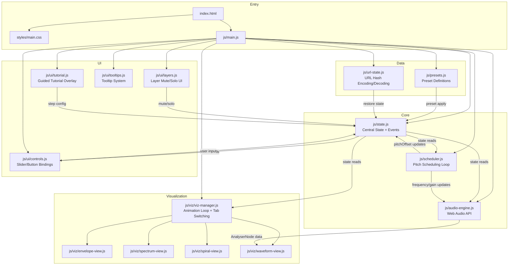
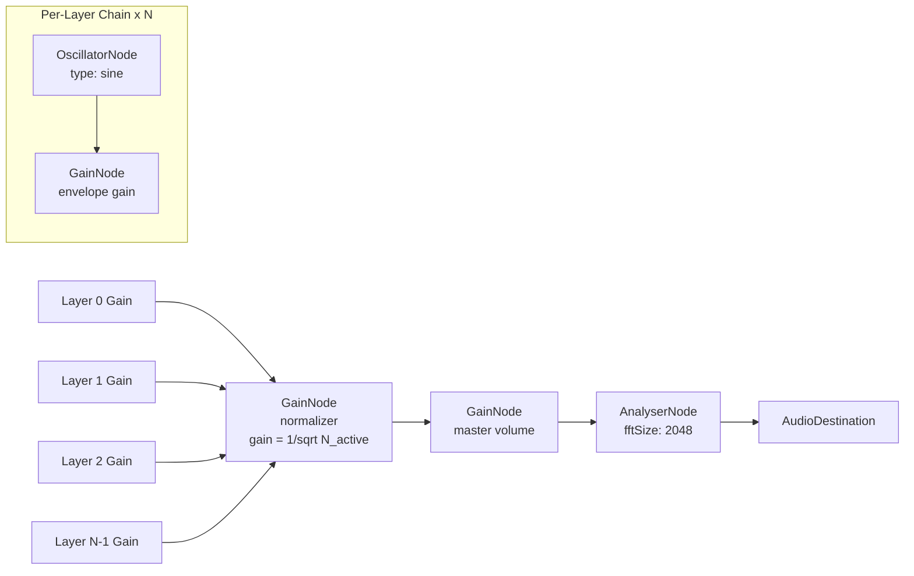
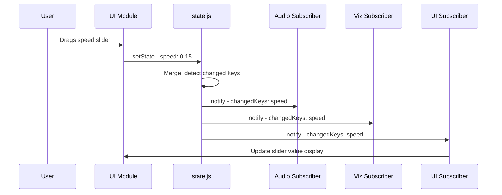

# Klangtreppe — Technical Specification

**Version:** 1.0
**Date:** 2026-03-02
**Status:** Draft
**Based on:** [PRD v1.0](./PRD.md)

---

## Table of Contents

1. [Architecture Overview](#1-architecture-overview)
2. [File Structure](#2-file-structure)
3. [Module Specifications](#3-module-specifications)
4. [Audio Engine Design](#4-audio-engine-design)
5. [State Management](#5-state-management)
6. [Visualization Specifications](#6-visualization-specifications)
7. [UI Component Specifications](#7-ui-component-specifications)
8. [URL State Encoding](#8-url-state-encoding)
9. [Tutorial System](#9-tutorial-system)
10. [Preset System](#10-preset-system)
11. [Performance Considerations](#11-performance-considerations)
12. [Accessibility Implementation](#12-accessibility-implementation)

---

## 1. Architecture Overview

Klangtreppe is a single-page, client-side-only web application built with vanilla HTML, CSS, and JavaScript (ES6+ modules). There are no frameworks, no build tools, and no backend dependencies.

### High-Level Module Diagram



### Data Flow Summary

1. **User interaction** → [`controls.js`](js/ui/controls.js) / [`layers.js`](js/ui/layers.js) → updates [`state.js`](js/state.js)
2. **State change** → emits event → listeners in [`audio-engine.js`](js/audio-engine.js), [`scheduler.js`](js/scheduler.js), [`viz-manager.js`](js/viz/viz-manager.js), UI modules
3. **Scheduler loop** (~20ms) → reads state → computes frequencies/amplitudes → updates Web Audio nodes via [`audio-engine.js`](js/audio-engine.js) → writes `pitchOffset` and per-layer `currentFreq`/`currentAmp` back to state
4. **Animation loop** (requestAnimationFrame) → reads state → renders active visualization on canvas

### Key Design Principles

- **Single source of truth**: All application state lives in [`state.js`](js/state.js). No module maintains its own shadow state.
- **Event-driven updates**: State changes emit events; modules subscribe to relevant events. No polling of state (except the scheduler and animation loops, which read state each tick by design).
- **Separation of concerns**: Audio, visualization, and UI are fully decoupled. They communicate only through state and events.
- **No build step**: All JS files use native ES6 `import`/`export`. The HTML file loads [`main.js`](js/main.js) with `type="module"`.

---

## 2. File Structure

```
klangtreppe/
├── index.html                      # Single HTML entry point
├── styles/
│   └── main.css                    # All styles (custom properties, layout, components)
├── js/
│   ├── main.js                     # Application bootstrap and initialization
│   ├── state.js                    # Central state object, event emitter, state API
│   ├── audio-engine.js             # Web Audio API node graph creation and management
│   ├── scheduler.js                # Pitch scheduling loop (frequency/gain updates)
│   ├── presets.js                  # Preset definitions and application logic
│   ├── url-state.js                # URL hash encoding/decoding/validation
│   ├── constants.js                # Shared constants (colors, limits, defaults)
│   ├── utils.js                    # Shared utility functions (math, formatting)
│   ├── ui/
│   │   ├── controls.js             # Main control panel bindings (direction, speed, envelope, mode)
│   │   ├── layers.js               # Layer list UI (mute/solo buttons, frequency/amplitude display)
│   │   ├── tutorial.js             # Tutorial overlay, step navigation, state manipulation
│   │   └── tooltips.js             # Tooltip creation, positioning, content
│   └── viz/
│       ├── viz-manager.js          # Animation loop, tab switching, canvas resize handling
│       ├── envelope-view.js        # Spectral Envelope visualization renderer
│       ├── spectrum-view.js        # Frequency Spectrum visualization renderer
│       ├── spiral-view.js          # Spiral / Barber Pole visualization renderer
│       └── waveform-view.js        # Waveform visualization renderer
└── specs-shepard/
    ├── PRD.md                      # Product Requirements Document
    └── TECHNICAL-SPEC.md           # This document
```

### File Descriptions

| File | Purpose |
|------|---------|
| [`index.html`](index.html) | Single-page HTML structure. Contains all semantic markup, ARIA attributes, and `<canvas>` element. Loads [`main.css`](styles/main.css) and [`main.js`](js/main.js). |
| [`styles/main.css`](styles/main.css) | Complete stylesheet using CSS custom properties for theming. Grid/flexbox layout. Responsive breakpoints. Dark theme. |
| [`js/main.js`](js/main.js) | Entry point. Initializes AudioContext on first user gesture, bootstraps all modules, restores URL state, sets up global keyboard shortcuts. |
| [`js/state.js`](js/state.js) | Central state store with typed schema, getter/setter API, and event emitter for change notifications. |
| [`js/audio-engine.js`](js/audio-engine.js) | Creates and manages the Web Audio API node graph (oscillators, gain nodes, analyser). Provides methods to create/destroy layers, set frequencies/gains, and access the AnalyserNode. |
| [`js/scheduler.js`](js/scheduler.js) | Runs the ~20ms scheduling loop. Computes pitch offset from elapsed time, calculates per-layer frequencies and envelope amplitudes, applies values to audio nodes. Handles octave wrapping and discrete step logic. |
| [`js/presets.js`](js/presets.js) | Defines the 8 preset configurations as data objects. Provides `applyPreset()` function. |
| [`js/url-state.js`](js/url-state.js) | Encodes state to URL hash fragment and decodes/validates hash back to state. |
| [`js/constants.js`](js/constants.js) | Shared constants: color palette, frequency limits, speed limits, default values, pitch class names. |
| [`js/utils.js`](js/utils.js) | Pure utility functions: `log2()`, `clamp()`, `lerp()`, `formatFrequency()`, `gaussianAmplitude()`. |
| [`js/ui/controls.js`](js/ui/controls.js) | Binds DOM controls (sliders, buttons, toggles) to state. Updates DOM when state changes. |
| [`js/ui/layers.js`](js/ui/layers.js) | Dynamically renders the layer list. Handles mute/solo logic. Displays per-layer frequency and amplitude. |
| [`js/ui/tutorial.js`](js/ui/tutorial.js) | Manages the 5-step tutorial overlay. Configures state per step. Handles navigation. |
| [`js/ui/tooltips.js`](js/ui/tooltips.js) | Creates tooltip elements, positions them on hover/focus, manages show/hide lifecycle. |
| [`js/viz/viz-manager.js`](js/viz/viz-manager.js) | Owns the `requestAnimationFrame` loop. Delegates rendering to the active view. Handles canvas resizing and DPI scaling. |
| [`js/viz/envelope-view.js`](js/viz/envelope-view.js) | Renders the Gaussian envelope curve and animated layer markers on a log-frequency axis. |
| [`js/viz/spectrum-view.js`](js/viz/spectrum-view.js) | Renders frequency spectrum bars with envelope overlay on a log-frequency axis. |
| [`js/viz/spiral-view.js`](js/viz/spiral-view.js) | Renders the circular pitch-class spiral with rotating layer dots. |
| [`js/viz/waveform-view.js`](js/viz/waveform-view.js) | Renders the time-domain waveform from AnalyserNode data. |

---

## 3. Module Specifications

### 3.1 `js/constants.js`

**Purpose:** Single source for all magic numbers, limits, defaults, and shared constants.

```typescript
// Type definitions (for documentation; actual code is plain JS)

/** Okabe-Ito colorblind-friendly palette for up to 8 layers */
const LAYER_COLORS: string[] = [
  '#E69F00', // orange
  '#56B4E9', // sky blue
  '#009E73', // bluish green
  '#F0E442', // yellow
  '#0072B2', // blue
  '#D55E00', // vermillion
  '#CC79A7', // reddish purple
  '#999999', // gray
];

const THEME = {
  background: '#1a1a2e',
  vizBackground: '#16213e',
  accent: '#f0a500',
  text: '#e0e0e0',
  textMuted: '#8888aa',
  controlBg: '#1f1f3a',
  controlBorder: '#2a2a4a',
  envelopeFill: 'rgba(240, 165, 0, 0.15)',
  envelopeStroke: 'rgba(240, 165, 0, 0.8)',
  gridLine: 'rgba(255, 255, 255, 0.08)',
  gridLabel: 'rgba(255, 255, 255, 0.4)',
};

const LIMITS = {
  minLayers: 3,
  maxLayers: 8,
  minSpeed: 0.033,          // ~2 octaves per minute
  maxSpeed: 0.4,            // ~2 octaves per 5 seconds
  defaultSpeed: 0.1,        // ~1 octave per 10 seconds
  minEnvelopeCenter: 100,   // Hz
  maxEnvelopeCenter: 5000,  // Hz
  defaultEnvelopeCenter: 500,
  minEnvelopeWidth: 1.0,    // octaves (sigma)
  maxEnvelopeWidth: 6.0,
  defaultEnvelopeWidth: 3.0,
  minStepRate: 0.5,         // steps per second
  maxStepRate: 4.0,
  defaultStepRate: 1.0,
  baseFrequency: 16.35,     // C0 in Hz — lowest base frequency
  schedulerIntervalMs: 20,
  audioTimeConstant: 0.01,  // 10ms for setTargetAtTime
  discreteCrossfadeMs: 50,
};

const STEP_INTERVALS = {
  semitone: 1 / 12,         // fraction of an octave
  wholetone: 2 / 12,
  minorthird: 3 / 12,
};

const PITCH_CLASSES: string[] = [
  'C', 'C♯', 'D', 'D♯', 'E', 'F',
  'F♯', 'G', 'G♯', 'A', 'A♯', 'B'
];
```

---

### 3.2 `js/utils.js`

**Purpose:** Pure, stateless utility functions used across modules.

#### Public API

```typescript
/**
 * Compute Gaussian envelope amplitude for a frequency.
 * @param freq - Current oscillator frequency in Hz
 * @param center - Envelope center frequency in Hz
 * @param sigma - Envelope width in octaves
 * @returns Amplitude value 0.0–1.0
 */
function gaussianAmplitude(freq: number, center: number, sigma: number): number;

/**
 * Clamp a value between min and max.
 */
function clamp(value: number, min: number, max: number): number;

/**
 * Linear interpolation between a and b.
 */
function lerp(a: number, b: number, t: number): number;

/**
 * Base-2 logarithm.
 */
function log2(x: number): number;

/**
 * Format a frequency value for display.
 * Returns e.g. "440 Hz" or "1.2 kHz"
 */
function formatFrequency(hz: number): string;

/**
 * Format amplitude as percentage string.
 */
function formatAmplitude(amp: number): string;

/**
 * Map a value from one range to another.
 */
function mapRange(value: number, inMin: number, inMax: number, outMin: number, outMax: number): number;

/**
 * Convert a linear slider position (0–1) to a logarithmic frequency value.
 * Used for the envelope center frequency slider.
 */
function sliderToLogFreq(position: number, minFreq: number, maxFreq: number): number;

/**
 * Inverse of sliderToLogFreq.
 */
function logFreqToSlider(freq: number, minFreq: number, maxFreq: number): number;
```

#### Implementation Details

```javascript
// gaussianAmplitude implementation
function gaussianAmplitude(freq, center, sigma) {
  const logDist = log2(freq) - log2(center);
  return Math.exp(-0.5 * (logDist / sigma) ** 2);
}

// Log-scale slider mapping
function sliderToLogFreq(position, minFreq, maxFreq) {
  const minLog = log2(minFreq);
  const maxLog = log2(maxFreq);
  return 2 ** (minLog + position * (maxLog - minLog));
}
```

---

### 3.3 `js/state.js`

**Purpose:** Central state store, event emitter, and state mutation API. All application state lives here. See [Section 5](#5-state-management) for the full schema.

#### Public API

```typescript
/**
 * Get the current state (read-only snapshot).
 * Returns a shallow copy to prevent direct mutation.
 */
function getState(): AppState;

/**
 * Update one or more state properties.
 * Emits 'stateChange' event with the changed keys.
 * @param partial - Object with keys to update
 */
function setState(partial: Partial<AppState>): void;

/**
 * Get a single state property.
 */
function getStateValue<K extends keyof AppState>(key: K): AppState[K];

/**
 * Subscribe to state changes.
 * @param keys - Array of state keys to watch, or '*' for all changes
 * @param callback - Called with (changedKeys: string[], newState: AppState)
 * @returns Unsubscribe function
 */
function subscribe(
  keys: Array<keyof AppState> | '*',
  callback: (changedKeys: string[], state: AppState) => void
): () => void;

/**
 * Update a specific layer's properties.
 * @param index - Layer index (0-based)
 * @param props - Properties to update on the layer
 */
function updateLayer(index: number, props: Partial<LayerState>): void;

/**
 * Reset state to defaults.
 */
function resetState(): void;
```

#### Internal Implementation

- State is stored as a plain object in module scope
- `setState()` performs a shallow merge, detects which keys changed, and emits events
- Subscribers are stored in a `Map<string, Set<Function>>` keyed by state property name, plus a `*` wildcard set
- `updateLayer()` is a convenience method that clones the layers array, updates the target layer, and calls `setState({ layers: newLayers })`

#### Dependencies

- [`js/constants.js`](js/constants.js) — for default values

---

### 3.4 `js/audio-engine.js`

**Purpose:** Creates and manages the Web Audio API node graph. Provides a clean API for the scheduler to set frequencies and gains without knowing Web Audio internals.

#### Public API

```typescript
/**
 * Initialize the audio engine. Must be called after a user gesture.
 * Creates the AudioContext and master chain.
 * @returns The AudioContext instance
 */
function initAudio(): AudioContext;

/**
 * Get the AudioContext (null if not initialized).
 */
function getAudioContext(): AudioContext | null;

/**
 * Rebuild the oscillator/gain node graph for the given layer count.
 * Stops and disconnects existing nodes, creates new ones.
 * @param layerCount - Number of layers (3–8)
 */
function rebuildLayers(layerCount: number): void;

/**
 * Set the frequency of a specific oscillator.
 * Uses setTargetAtTime for smooth transitions.
 * @param index - Layer index
 * @param frequency - Target frequency in Hz
 * @param timeConstant - Smoothing time constant in seconds
 */
function setLayerFrequency(index: number, frequency: number, timeConstant: number): void;

/**
 * Set the gain of a specific layer's envelope gain node.
 * @param index - Layer index
 * @param gain - Target gain value (0.0–1.0)
 * @param timeConstant - Smoothing time constant in seconds
 */
function setLayerGain(index: number, gain: number, timeConstant: number): void;

/**
 * Set the normalizer gain (1/sqrt(N)).
 * @param activeCount - Number of active (non-muted) layers
 */
function setNormalizerGain(activeCount: number): void;

/**
 * Set the master volume.
 * @param volume - Volume level (0.0–1.0)
 */
function setMasterVolume(volume: number): void;

/**
 * Start all oscillators. Call after rebuildLayers.
 */
function startOscillators(): void;

/**
 * Stop all oscillators and clean up.
 */
function stopOscillators(): void;

/**
 * Get the AnalyserNode for waveform/spectrum visualization.
 */
function getAnalyser(): AnalyserNode;

/**
 * Resume the AudioContext (needed for iOS Safari).
 */
function resumeContext(): Promise<void>;

/**
 * Suspend the AudioContext (when stopping playback).
 */
function suspendContext(): Promise<void>;
```

#### Internal Implementation

See [Section 4](#4-audio-engine-design) for the full node graph and scheduling details.

**Internal data structures:**

```javascript
// Module-scoped variables
let audioCtx = null;           // AudioContext
let oscillators = [];          // OscillatorNode[]
let layerGains = [];           // GainNode[] — per-layer envelope gains
let normalizerGain = null;     // GainNode — 1/sqrt(N)
let masterGain = null;         // GainNode — master volume
let analyser = null;           // AnalyserNode
```

#### Dependencies

- [`js/constants.js`](js/constants.js) — for `LIMITS.audioTimeConstant`

---

### 3.5 `js/scheduler.js`

**Purpose:** Runs the core scheduling loop that advances pitch offset over time, computes per-layer frequencies and envelope amplitudes, and pushes values to the audio engine. This is the "brain" of the Shepard's Tone.

#### Public API

```typescript
/**
 * Start the scheduling loop.
 * Begins advancing pitchOffset based on elapsed time.
 */
function startScheduler(): void;

/**
 * Stop the scheduling loop.
 */
function stopScheduler(): void;

/**
 * Check if the scheduler is currently running.
 */
function isSchedulerRunning(): boolean;
```

#### Internal Implementation

See [Section 4.2](#42-scheduling-algorithm) for detailed pseudocode.

**Key internal functions:**

```typescript
/** Main tick function, called every ~20ms */
function tick(): void;

/** Compute frequency for a layer given current pitchOffset */
function computeLayerFrequency(layerIndex: number, pitchOffset: number): number;

/** Handle octave wrapping when pitchOffset >= 1.0 */
function wrapPitchOffset(offset: number): number;

/** Handle discrete step advancement */
function advanceDiscreteStep(): void;
```

#### Dependencies

- [`js/state.js`](js/state.js) — reads `speed`, `direction`, `isFrozen`, `mode`, `stepInterval`, `stepRate`, `envelopeCenter`, `envelopeWidth`, `envelopeEnabled`, `layers`; writes `pitchOffset`, layer `currentFreq`/`currentAmp`
- [`js/audio-engine.js`](js/audio-engine.js) — calls `setLayerFrequency()`, `setLayerGain()`, `setNormalizerGain()`
- [`js/utils.js`](js/utils.js) — calls `gaussianAmplitude()`
- [`js/constants.js`](js/constants.js) — reads `LIMITS`, `STEP_INTERVALS`

---

### 3.6 `js/presets.js`

**Purpose:** Defines preset configurations and provides logic to apply them. See [Section 10](#10-preset-system) for full preset data.

#### Public API

```typescript
/** Preset definition type */
interface PresetDefinition {
  id: string;
  name: string;
  description: string;
  config: Partial<AppState>;
}

/**
 * Get all preset definitions.
 */
function getPresets(): PresetDefinition[];

/**
 * Apply a preset by ID. Updates state with preset config values.
 * @param presetId - The preset identifier
 */
function applyPreset(presetId: string): void;

/**
 * Check if the current state matches any preset.
 * @returns The matching preset ID, or null
 */
function getActivePreset(): string | null;
```

#### Dependencies

- [`js/state.js`](js/state.js) — calls `setState()`

---

### 3.7 `js/url-state.js`

**Purpose:** Serializes application state to a URL hash fragment and deserializes it back. See [Section 8](#8-url-state-encoding) for the encoding format.

#### Public API

```typescript
/**
 * Encode the current state as a URL hash string.
 * @returns Hash string (without the leading #)
 */
function encodeStateToHash(): string;

/**
 * Decode a URL hash string into a partial state object.
 * Returns null if the hash is invalid or empty.
 * @param hash - Hash string (without the leading #)
 * @returns Partial state object, or null
 */
function decodeHashToState(hash: string): Partial<AppState> | null;

/**
 * Update the browser URL hash to reflect current state.
 * Uses replaceState to avoid polluting history.
 */
function pushStateToUrl(): void;

/**
 * Read the current URL hash and apply it to state if valid.
 * Called on application startup.
 * @returns true if a valid hash was found and applied
 */
function restoreStateFromUrl(): boolean;

/**
 * Copy the shareable URL to clipboard.
 * @returns Promise that resolves when copied
 */
function copyShareUrl(): Promise<void>;
```

#### Dependencies

- [`js/state.js`](js/state.js) — calls `getState()`, `setState()`
- [`js/constants.js`](js/constants.js) — for validation limits

---

### 3.8 `js/main.js`

**Purpose:** Application entry point. Bootstraps all modules, handles AudioContext initialization on first user gesture, and coordinates startup sequence.

#### Initialization Sequence

```javascript
// 1. Import all modules
import { resetState, subscribe, setState } from './state.js';
import { initAudio, resumeContext } from './audio-engine.js';
import { startScheduler, stopScheduler } from './scheduler.js';
import { initVizManager } from './viz/viz-manager.js';
import { initControls } from './ui/controls.js';
import { initLayers } from './ui/layers.js';
import { initTutorial } from './ui/tutorial.js';
import { initTooltips } from './ui/tooltips.js';
import { restoreStateFromUrl } from './url-state.js';

// 2. On DOMContentLoaded:
function init() {
  // a. Initialize state with defaults
  resetState();

  // b. Restore state from URL hash (if present)
  restoreStateFromUrl();

  // c. Initialize UI modules (bind DOM elements, set up event listeners)
  initControls();
  initLayers();
  initTutorial();
  initTooltips();

  // d. Initialize visualization manager (set up canvas, start animation loop)
  initVizManager();

  // e. Set up play button to initialize AudioContext on first click
  setupPlayButton();

  // f. Set up global keyboard shortcuts
  setupKeyboardShortcuts();
}

// 3. First play click:
async function handleFirstPlay() {
  const ctx = initAudio();
  await resumeContext();
  // Subsequent play/stop calls use startScheduler/stopScheduler
}
```

#### Dependencies

- All other modules (orchestration role)

---

### 3.9 `js/viz/viz-manager.js`

**Purpose:** Manages the `requestAnimationFrame` animation loop, delegates rendering to the active visualization view, handles canvas sizing and DPI scaling, and manages tab switching.

#### Public API

```typescript
/**
 * Initialize the visualization manager.
 * Sets up canvas, handles resize, starts the animation loop.
 */
function initVizManager(): void;

/**
 * Switch to a different visualization view.
 * @param viewId - 'envelope' | 'spectrum' | 'spiral' | 'waveform'
 */
function switchView(viewId: string): void;

/**
 * Get the current canvas 2D rendering context.
 */
function getCanvasContext(): CanvasRenderingContext2D;

/**
 * Get the current canvas dimensions (logical pixels).
 */
function getCanvasDimensions(): { width: number; height: number };
```

#### Internal Implementation

```javascript
// Animation loop
let animationFrameId = null;
let activeView = null; // Reference to current view's render function

function animationLoop(timestamp) {
  const ctx = canvas.getContext('2d');
  const { width, height } = getCanvasDimensions();

  // Clear canvas
  ctx.clearRect(0, 0, width, height);

  // Delegate to active view
  if (activeView) {
    activeView.render(ctx, width, height, timestamp);
  }

  animationFrameId = requestAnimationFrame(animationLoop);
}

// Canvas DPI scaling
function setupCanvas() {
  const dpr = window.devicePixelRatio || 1;
  const rect = canvas.getBoundingClientRect();
  canvas.width = rect.width * dpr;
  canvas.height = rect.height * dpr;
  const ctx = canvas.getContext('2d');
  ctx.scale(dpr, dpr);
  // Store logical dimensions
  logicalWidth = rect.width;
  logicalHeight = rect.height;
}
```

#### Dependencies

- [`js/state.js`](js/state.js) — reads `activeVisualization`
- [`js/viz/envelope-view.js`](js/viz/envelope-view.js), [`js/viz/spectrum-view.js`](js/viz/spectrum-view.js), [`js/viz/spiral-view.js`](js/viz/spiral-view.js), [`js/viz/waveform-view.js`](js/viz/waveform-view.js) — view renderers

---

### 3.10 `js/viz/envelope-view.js`

**Purpose:** Renders the Spectral Envelope visualization. See [Section 6.1](#61-spectral-envelope-view) for full rendering details.

#### Public API

```typescript
/**
 * Render one frame of the envelope visualization.
 * @param ctx - Canvas 2D context
 * @param width - Logical canvas width
 * @param height - Logical canvas height
 * @param timestamp - requestAnimationFrame timestamp
 */
function render(ctx: CanvasRenderingContext2D, width: number, height: number, timestamp: number): void;
```

#### Dependencies

- [`js/state.js`](js/state.js) — reads envelope params, layer data, `pitchOffset`
- [`js/utils.js`](js/utils.js) — `gaussianAmplitude()`, `log2()`
- [`js/constants.js`](js/constants.js) — `LAYER_COLORS`, `THEME`, `LIMITS`

---

### 3.11 `js/viz/spectrum-view.js`

**Purpose:** Renders the Frequency Spectrum visualization. See [Section 6.2](#62-frequency-spectrum-view).

#### Public API

Same signature as [`envelope-view.js`](js/viz/envelope-view.js):

```typescript
function render(ctx: CanvasRenderingContext2D, width: number, height: number, timestamp: number): void;
```

#### Dependencies

Same as [`envelope-view.js`](js/viz/envelope-view.js).

---

### 3.12 `js/viz/spiral-view.js`

**Purpose:** Renders the Spiral / Barber Pole visualization. See [Section 6.3](#63-spiral--barber-pole-view).

#### Public API

Same `render()` signature.

#### Dependencies

- [`js/state.js`](js/state.js) — reads layer data, `pitchOffset`, `direction`
- [`js/constants.js`](js/constants.js) — `LAYER_COLORS`, `PITCH_CLASSES`, `THEME`

---

### 3.13 `js/viz/waveform-view.js`

**Purpose:** Renders the time-domain waveform. See [Section 6.4](#64-waveform-view).

#### Public API

Same `render()` signature.

#### Dependencies

- [`js/audio-engine.js`](js/audio-engine.js) — `getAnalyser()` for time-domain data
- [`js/constants.js`](js/constants.js) — `THEME`

---

### 3.14 `js/ui/controls.js`

**Purpose:** Binds all sidebar control elements (sliders, buttons, toggles) to state. Listens for state changes to update DOM.

#### Public API

```typescript
/**
 * Initialize all control bindings.
 * Queries DOM elements, attaches event listeners, subscribes to state.
 */
function initControls(): void;
```

#### Internal Implementation

- Each control element is queried by `id` or `data-*` attribute
- Input events on sliders call `setState()` with the new value
- Click events on buttons call `setState()` with toggled values
- State change subscriptions update DOM elements (slider positions, button active states, value displays)
- Direction buttons use a radio-button pattern (only one active at a time)
- The play/stop button toggles `isPlaying` and triggers audio start/stop

#### Dependencies

- [`js/state.js`](js/state.js) — `setState()`, `subscribe()`
- [`js/audio-engine.js`](js/audio-engine.js) — `startOscillators()`, `stopOscillators()`, `rebuildLayers()`
- [`js/scheduler.js`](js/scheduler.js) — `startScheduler()`, `stopScheduler()`
- [`js/presets.js`](js/presets.js) — `applyPreset()`, `getActivePreset()`
- [`js/url-state.js`](js/url-state.js) — `copyShareUrl()`
- [`js/utils.js`](js/utils.js) — `sliderToLogFreq()`, `formatFrequency()`

---

### 3.15 `js/ui/layers.js`

**Purpose:** Dynamically renders the layer list in the sidebar. Manages mute/solo interactions.

#### Public API

```typescript
/**
 * Initialize the layer list UI.
 * Renders initial layer items, sets up event delegation.
 */
function initLayers(): void;
```

#### Internal Implementation

- Renders a list of layer items into a container element
- Each item shows: color indicator (circle), layer name ("Schicht N"), current frequency, current amplitude bar, solo [S] button, mute [M] button
- **Solo logic**: When a layer is soloed, all other layers are muted. If the same layer is soloed again, all layers are unmuted (toggle behavior). Only one layer can be soloed at a time.
- **Mute logic**: Toggles the `enabled` property of the layer. If a soloed layer is muted, solo is cleared.
- Subscribes to `layers` and `layerCount` state changes to re-render
- Uses event delegation on the container for button clicks
- Frequency and amplitude displays update every animation frame (driven by state changes from the scheduler)

#### Dependencies

- [`js/state.js`](js/state.js) — `subscribe()`, `updateLayer()`, `getState()`
- [`js/constants.js`](js/constants.js) — `LAYER_COLORS`
- [`js/utils.js`](js/utils.js) — `formatFrequency()`, `formatAmplitude()`

---

### 3.16 `js/ui/tutorial.js`

**Purpose:** Manages the guided tutorial overlay. See [Section 9](#9-tutorial-system) for step definitions.

#### Public API

```typescript
/**
 * Initialize the tutorial system.
 * Sets up the overlay element and navigation buttons.
 */
function initTutorial(): void;

/**
 * Start the tutorial from step 1.
 */
function startTutorial(): void;

/**
 * End the tutorial and return to free exploration.
 */
function endTutorial(): void;
```

#### Dependencies

- [`js/state.js`](js/state.js) — `setState()`, `subscribe()`
- [`js/presets.js`](js/presets.js) — uses preset configs for step setup

---

### 3.17 `js/ui/tooltips.js`

**Purpose:** Tooltip system for control labels and educational hints.

#### Public API

```typescript
/**
 * Initialize tooltips for all elements with data-tooltip attributes.
 */
function initTooltips(): void;
```

#### Internal Implementation

- Scans for all elements with `data-tooltip` attribute
- On `mouseenter` / `focus`, creates a positioned tooltip element
- On `mouseleave` / `blur`, removes the tooltip after a short delay
- Tooltip content is defined in the `data-tooltip` attribute (German text)
- Positioning: above the element by default, flips below if near viewport top
- Uses a single reusable tooltip DOM element (moved and updated)

#### Dependencies

- None (pure DOM manipulation)

---

## 4. Audio Engine Design

### 4.1 Web Audio API Node Graph



**Node configuration details:**

| Node | Property | Value |
|------|----------|-------|
| `OscillatorNode` | `type` | `'sine'` |
| `OscillatorNode` | `frequency.value` | Set dynamically by scheduler |
| Layer `GainNode` | `gain.value` | Set dynamically by scheduler (envelope amplitude × mute state) |
| Normalizer `GainNode` | `gain.value` | `1 / Math.sqrt(activeLayerCount)` |
| Master `GainNode` | `gain.value` | `state.masterVolume` (0.0–1.0) |
| `AnalyserNode` | `fftSize` | `2048` |
| `AnalyserNode` | `smoothingTimeConstant` | `0.8` |

### 4.2 Scheduling Algorithm

The scheduler runs as a `setInterval` loop at ~20ms intervals. It is separate from the `requestAnimationFrame` loop to ensure consistent audio timing regardless of frame rate.

#### Continuous Mode Pseudocode

```
FUNCTION tick():
    state = getState()
    now = audioCtx.currentTime
    
    IF state.isFrozen OR NOT state.isPlaying:
        RETURN
    
    // 1. Compute elapsed time since last tick
    deltaTime = now - lastTickTime
    lastTickTime = now
    
    // 2. Advance pitch offset based on direction and speed
    IF state.direction == 'ascending':
        pitchOffset += deltaTime * state.speed
    ELSE IF state.direction == 'descending':
        pitchOffset -= deltaTime * state.speed
    // 'paused' direction: no change
    
    // 3. Wrap pitch offset to [0, 1) range
    pitchOffset = wrapPitchOffset(pitchOffset)
    
    // 4. Count active layers for normalization
    activeCount = 0
    
    // 5. For each layer, compute frequency and envelope amplitude
    FOR i = 0 TO state.layerCount - 1:
        layer = state.layers[i]
        
        // Compute frequency: baseFreq * 2^(pitchOffset + i)
        freq = LIMITS.baseFrequency * Math.pow(2, pitchOffset + i)
        
        // Compute envelope amplitude
        IF state.envelopeEnabled:
            amp = gaussianAmplitude(freq, state.envelopeCenter, state.envelopeWidth)
        ELSE:
            amp = 1.0
        
        // Apply mute state
        IF NOT layer.enabled:
            amp = 0.0
        ELSE:
            activeCount += 1
        
        // Set audio node values with smooth transition
        setLayerFrequency(i, freq, LIMITS.audioTimeConstant)
        setLayerGain(i, amp, LIMITS.audioTimeConstant)
        
        // Update state for visualization
        updateLayer(i, { currentFreq: freq, currentAmp: amp })
    
    // 6. Update normalizer gain
    setNormalizerGain(activeCount > 0 ? activeCount : 1)
    
    // 7. Write pitchOffset back to state
    setState({ pitchOffset: pitchOffset })

FUNCTION wrapPitchOffset(offset):
    // Wrap to [0, 1) — seamless because layers are octave-spaced
    WHILE offset >= 1.0:
        offset -= 1.0
    WHILE offset < 0.0:
        offset += 1.0
    RETURN offset
```

#### Discrete Step Mode Pseudocode

```
// Module-scoped
let lastStepTime = 0
let currentStepOffset = 0  // Accumulated step offset in octaves

FUNCTION tickDiscrete():
    state = getState()
    now = audioCtx.currentTime
    
    IF state.isFrozen OR NOT state.isPlaying:
        RETURN
    
    // Check if it is time for the next step
    stepPeriod = 1.0 / state.stepRate
    IF now - lastStepTime >= stepPeriod:
        lastStepTime = now
        
        // Advance by one step interval
        stepSize = STEP_INTERVALS[state.stepInterval]
        IF state.direction == 'ascending':
            currentStepOffset += stepSize
        ELSE IF state.direction == 'descending':
            currentStepOffset -= stepSize
        
        // Wrap to [0, 1)
        currentStepOffset = wrapPitchOffset(currentStepOffset)
    
    // Use currentStepOffset as pitchOffset
    // Apply frequencies with a slightly longer time constant for crossfade
    crossfadeConstant = LIMITS.discreteCrossfadeMs / 1000
    
    activeCount = 0
    FOR i = 0 TO state.layerCount - 1:
        layer = state.layers[i]
        freq = LIMITS.baseFrequency * Math.pow(2, currentStepOffset + i)
        
        IF state.envelopeEnabled:
            amp = gaussianAmplitude(freq, state.envelopeCenter, state.envelopeWidth)
        ELSE:
            amp = 1.0
        
        IF NOT layer.enabled:
            amp = 0.0
        ELSE:
            activeCount += 1
        
        setLayerFrequency(i, freq, crossfadeConstant)
        setLayerGain(i, amp, crossfadeConstant)
        updateLayer(i, { currentFreq: freq, currentAmp: amp })
    
    setNormalizerGain(activeCount > 0 ? activeCount : 1)
    setState({ pitchOffset: currentStepOffset })
```

### 4.3 Octave Wrapping Logic

The octave wrapping is mathematically seamless due to the octave-spaced layer structure:

```
Before wrap (pitchOffset approaching 1.0, 4 layers):
  Layer 0: baseFreq * 2^(0.99 + 0) = baseFreq * 2^0.99
  Layer 1: baseFreq * 2^(0.99 + 1) = baseFreq * 2^1.99
  Layer 2: baseFreq * 2^(0.99 + 2) = baseFreq * 2^2.99
  Layer 3: baseFreq * 2^(0.99 + 3) = baseFreq * 2^3.99

After wrap (pitchOffset wraps to 0.0):
  Layer 0: baseFreq * 2^(0.0 + 0) = baseFreq * 2^0.0
  Layer 1: baseFreq * 2^(0.0 + 1) = baseFreq * 2^1.0
  Layer 2: baseFreq * 2^(0.0 + 2) = baseFreq * 2^2.0
  Layer 3: baseFreq * 2^(0.0 + 3) = baseFreq * 2^3.0
```

At the wrap point, the highest layer (Layer 3) jumps from `baseFreq * 2^3.99` down to `baseFreq * 2^3.0` — but this layer is at the extreme edge of the spectral envelope where its amplitude is near zero. Simultaneously, Layer 0 jumps from `baseFreq * 2^0.99` to `baseFreq * 2^0.0` — also at the envelope edge with near-zero amplitude. The `setTargetAtTime` smoothing ensures no click occurs during the frequency jump because the gain is already negligible.

### 4.4 Envelope Application

The Gaussian envelope is applied in the log-frequency domain:

```javascript
function gaussianAmplitude(freq, center, sigma) {
  // Distance in octaves between freq and center
  const logDist = Math.log2(freq) - Math.log2(center);
  // Gaussian: peak at center, width controlled by sigma
  return Math.exp(-0.5 * (logDist / sigma) ** 2);
}
```

**Envelope behavior at boundaries:**

| Sigma (octaves) | Amplitude at ±1 octave | Amplitude at ±2 octaves | Amplitude at ±3 octaves |
|-----------------|----------------------|----------------------|----------------------|
| 1.0 | 0.607 | 0.135 | 0.011 |
| 2.0 | 0.882 | 0.607 | 0.325 |
| 3.0 | 0.946 | 0.800 | 0.607 |

With the default sigma of 3.0 octaves and 6 layers spanning 6 octaves, the outermost layers are at ~0.607 amplitude — still audible but significantly reduced, creating a smooth fade.

### 4.5 Gain Normalization

To prevent clipping when multiple layers are active:

```javascript
function setNormalizerGain(activeCount) {
  const gain = 1.0 / Math.sqrt(Math.max(activeCount, 1));
  normalizerGain.gain.setTargetAtTime(gain, audioCtx.currentTime, 0.01);
}
```

The `1/√N` factor is chosen because uncorrelated sine waves sum in power (not amplitude), so the RMS amplitude of N equal-amplitude sines is `√N` times a single sine. Dividing by `√N` keeps the RMS level constant regardless of layer count.

### 4.6 AudioContext Initialization and iOS Safari Handling

```javascript
function initAudio() {
  // Create AudioContext (with webkit prefix fallback)
  const AudioCtx = window.AudioContext || window.webkitAudioContext;
  audioCtx = new AudioCtx();

  // Create master chain (always exists)
  normalizerGain = audioCtx.createGain();
  masterGain = audioCtx.createGain();
  analyser = audioCtx.createAnalyser();
  analyser.fftSize = 2048;
  analyser.smoothingTimeConstant = 0.8;

  normalizerGain.connect(masterGain);
  masterGain.connect(analyser);
  analyser.connect(audioCtx.destination);

  return audioCtx;
}

async function resumeContext() {
  // iOS Safari requires resume() after a user gesture
  if (audioCtx && audioCtx.state === 'suspended') {
    await audioCtx.resume();
  }
}
```

### 4.7 Layer Rebuild Strategy

When the layer count changes, the entire oscillator bank is rebuilt:

```javascript
function rebuildLayers(layerCount) {
  const wasPlaying = oscillators.length > 0;

  // Stop and disconnect existing oscillators
  for (const osc of oscillators) {
    osc.stop();
    osc.disconnect();
  }
  for (const gain of layerGains) {
    gain.disconnect();
  }

  oscillators = [];
  layerGains = [];

  // Create new oscillator/gain pairs
  for (let i = 0; i < layerCount; i++) {
    const osc = audioCtx.createOscillator();
    osc.type = 'sine';

    const gain = audioCtx.createGain();
    gain.gain.value = 0; // Start silent, scheduler will set proper values

    osc.connect(gain);
    gain.connect(normalizerGain);

    oscillators.push(osc);
    layerGains.push(gain);

    if (wasPlaying) {
      osc.start();
    }
  }
}
```

---

## 5. State Management

### 5.1 Full State Schema

```typescript
interface LayerState {
  enabled: boolean;      // true = audible, false = muted
  soloed: boolean;       // true = this layer is soloed
  currentFreq: number;   // Current frequency in Hz (updated by scheduler)
  currentAmp: number;    // Current amplitude 0–1 (updated by scheduler)
}

interface AppState {
  // Playback
  isPlaying: boolean;           // Default: false
  isFrozen: boolean;            // Default: false
  direction: 'ascending' | 'descending' | 'paused';  // Default: 'ascending'
  speed: number;                // Octaves per second. Default: 0.1
  masterVolume: number;         // 0.0–1.0. Default: 0.5

  // Envelope
  envelopeCenter: number;       // Hz. Default: 500
  envelopeWidth: number;        // Octaves (sigma). Default: 3.0
  envelopeEnabled: boolean;     // Default: true

  // Layers
  layerCount: number;           // 3–8. Default: 6
  layers: LayerState[];         // Array of length layerCount

  // Mode
  mode: 'continuous' | 'discrete';  // Default: 'continuous'
  stepInterval: 'semitone' | 'wholetone' | 'minorthird';  // Default: 'semitone'
  stepRate: number;             // Steps per second. Default: 1.0

  // Position
  pitchOffset: number;          // 0.0–1.0, current position in octave cycle. Default: 0.0

  // UI
  activeVisualization: 'envelope' | 'spectrum' | 'spiral' | 'waveform';  // Default: 'envelope'
  tutorialStep: number | null;  // null = free mode, 1–5 = tutorial step. Default: null
  activePreset: string | null;  // Currently active preset ID, or null. Default: 'klassisch'
}
```

### 5.2 Default State

```javascript
const DEFAULT_STATE = {
  isPlaying: false,
  isFrozen: false,
  direction: 'ascending',
  speed: 0.1,
  masterVolume: 0.5,
  envelopeCenter: 500,
  envelopeWidth: 3.0,
  envelopeEnabled: true,
  layerCount: 6,
  layers: Array.from({ length: 6 }, () => ({
    enabled: true,
    soloed: false,
    currentFreq: 0,
    currentAmp: 0,
  })),
  mode: 'continuous',
  stepInterval: 'semitone',
  stepRate: 1.0,
  pitchOffset: 0.0,
  activeVisualization: 'envelope',
  tutorialStep: null,
  activePreset: 'klassisch',
};
```

### 5.3 State Update Flow



### 5.4 Event Emitter Implementation

```javascript
// Internal subscriber storage
const subscribers = new Map(); // key -> Set<callback>
// '*' key for wildcard subscribers

function setState(partial) {
  const changedKeys = [];

  for (const [key, value] of Object.entries(partial)) {
    if (state[key] !== value) {
      state[key] = value;
      changedKeys.push(key);
    }
  }

  if (changedKeys.length === 0) return;

  // Notify specific-key subscribers
  for (const key of changedKeys) {
    const subs = subscribers.get(key);
    if (subs) {
      for (const cb of subs) {
        cb(changedKeys, { ...state });
      }
    }
  }

  // Notify wildcard subscribers
  const wildcardSubs = subscribers.get('*');
  if (wildcardSubs) {
    for (const cb of wildcardSubs) {
      cb(changedKeys, { ...state });
    }
  }
}

function subscribe(keys, callback) {
  const keyList = keys === '*' ? ['*'] : keys;
  for (const key of keyList) {
    if (!subscribers.has(key)) {
      subscribers.set(key, new Set());
    }
    subscribers.get(key).add(callback);
  }

  // Return unsubscribe function
  return () => {
    for (const key of keyList) {
      const subs = subscribers.get(key);
      if (subs) subs.delete(callback);
    }
  };
}
```

### 5.5 Layer State Management

Layer state requires special handling because it is an array of objects:

```javascript
function updateLayer(index, props) {
  const newLayers = state.layers.map((layer, i) => {
    if (i === index) {
      return { ...layer, ...props };
    }
    return layer;
  });
  setState({ layers: newLayers });
}
```

**Solo logic** (implemented in [`js/ui/layers.js`](js/ui/layers.js)):

```javascript
function handleSolo(layerIndex) {
  const state = getState();
  const layer = state.layers[layerIndex];

  if (layer.soloed) {
    // Un-solo: enable all layers, clear solo
    const newLayers = state.layers.map(l => ({
      ...l,
      soloed: false,
      enabled: true,
    }));
    setState({ layers: newLayers });
  } else {
    // Solo this layer: mute all others, solo this one
    const newLayers = state.layers.map((l, i) => ({
      ...l,
      soloed: i === layerIndex,
      enabled: i === layerIndex,
    }));
    setState({ layers: newLayers });
  }
}
```

### 5.6 Layer Count Changes

When `layerCount` changes, the `layers` array must be resized:

```javascript
subscribe(['layerCount'], (changedKeys, newState) => {
  const currentLayers = newState.layers;
  const targetCount = newState.layerCount;

  if (currentLayers.length === targetCount) return;

  let newLayers;
  if (targetCount > currentLayers.length) {
    // Add new layers (enabled, not soloed)
    newLayers = [
      ...currentLayers,
      ...Array.from({ length: targetCount - currentLayers.length }, () => ({
        enabled: true,
        soloed: false,
        currentFreq: 0,
        currentAmp: 0,
      })),
    ];
  } else {
    // Remove excess layers
    newLayers = currentLayers.slice(0, targetCount);
  }

  // Clear any solo state if the soloed layer was removed
  const hasSolo = newLayers.some(l => l.soloed);
  if (!hasSolo) {
    newLayers = newLayers.map(l => ({ ...l, enabled: true }));
  }

  setState({ layers: newLayers });
  rebuildLayers(targetCount);
});
```

---

## 6. Visualization Specifications

All visualizations share a common interface and are rendered on a single `<canvas>` element managed by [`viz-manager.js`](js/viz/viz-manager.js). Only the active visualization's `render()` function is called each frame.

### Common Rendering Infrastructure

```javascript
// Shared by all views: coordinate system helpers

/**
 * Map a frequency (Hz) to an x-coordinate on a log-frequency axis.
 * @param freq - Frequency in Hz
 * @param width - Canvas width in logical pixels
 * @param minFreq - Left edge frequency (e.g., 20 Hz)
 * @param maxFreq - Right edge frequency (e.g., 20000 Hz)
 * @returns x coordinate
 */
function freqToX(freq, width, minFreq = 20, maxFreq = 20000) {
  const logMin = Math.log2(minFreq);
  const logMax = Math.log2(maxFreq);
  const logFreq = Math.log2(freq);
  return ((logFreq - logMin) / (logMax - logMin)) * width;
}

/**
 * Map an amplitude (0–1) to a y-coordinate.
 * @param amp - Amplitude 0–1
 * @param height - Canvas height
 * @param padding - Top/bottom padding
 * @returns y coordinate (0 = top of plot area)
 */
function ampToY(amp, height, padding = 40) {
  const plotHeight = height - 2 * padding;
  return padding + (1 - amp) * plotHeight;
}
```

### 6.1 Spectral Envelope View

**Purpose:** Shows the Gaussian envelope curve with animated layer markers moving along it. This is the primary educational visualization — it directly shows *why* the illusion works.

#### Coordinate System

- **X-axis:** Log-frequency, 20 Hz to 20,000 Hz
- **Y-axis:** Amplitude, 0.0 (bottom) to 1.0 (top)
- **Padding:** 40px top/bottom, 60px left (for labels), 20px right

#### Rendering Steps (per frame)

```
1. DRAW BACKGROUND
   - Fill with THEME.vizBackground
   
2. DRAW GRID
   - Vertical lines at octave frequencies: 32, 64, 128, 256, 512, 1024, 2048, 4096, 8192, 16384 Hz
   - Horizontal lines at amplitude: 0.0, 0.25, 0.5, 0.75, 1.0
   - Label frequencies on x-axis: "64", "128", "256", "512", "1k", "2k", "4k", "8k", "16k"
   - Label amplitudes on y-axis: "0", "0.25", "0.5", "0.75", "1.0"
   - Grid color: THEME.gridLine
   - Label color: THEME.gridLabel

3. DRAW ENVELOPE CURVE
   IF state.envelopeEnabled:
     - Sample the Gaussian function at ~200 points across the frequency range
     - For each sample point:
       x = freqToX(freq)
       y = ampToY(gaussianAmplitude(freq, state.envelopeCenter, state.envelopeWidth))
     - Draw as a filled path with THEME.envelopeFill
     - Draw the stroke with THEME.envelopeStroke, lineWidth 2
   ELSE:
     - Draw a horizontal line at amplitude = 1.0 across the full width
     - Label: "Hüllkurve deaktiviert"

4. DRAW LAYER MARKERS
   FOR each layer i in state.layers:
     freq = layer.currentFreq
     amp = layer.currentAmp
     
     IF freq <= 0: CONTINUE  // Not yet initialized
     
     x = freqToX(freq)
     y = ampToY(amp)
     
     // Draw dot
     radius = 6 + amp * 4  // 6–10px, larger when louder
     color = LAYER_COLORS[i]
     
     IF NOT layer.enabled:
       // Muted: draw as hollow circle with reduced opacity
       ctx.strokeStyle = color + '80'  // 50% opacity
       ctx.beginPath()
       ctx.arc(x, y, radius, 0, 2 * Math.PI)
       ctx.stroke()
     ELSE:
       // Active: draw as filled circle with glow
       ctx.shadowColor = color
       ctx.shadowBlur = 8 * amp
       ctx.fillStyle = color
       ctx.beginPath()
       ctx.arc(x, y, radius, 0, 2 * Math.PI)
       ctx.fill()
       ctx.shadowBlur = 0
     
     // Draw frequency label below dot
     ctx.fillStyle = THEME.text
     ctx.font = '10px monospace'
     ctx.textAlign = 'center'
     ctx.fillText(formatFrequency(freq), x, y + radius + 14)

5. DRAW AXIS LABELS
   - X-axis: "Frequenz (Hz)" centered below
   - Y-axis: "Amplitude" rotated vertically on left
```

#### Data Flow

```
state.envelopeCenter ──┐
state.envelopeWidth  ──┤── Envelope curve shape
state.envelopeEnabled ─┘
state.layers[].currentFreq ──┐
state.layers[].currentAmp  ──┤── Layer marker positions
state.layers[].enabled     ──┘
```

---

### 6.2 Frequency Spectrum View

**Purpose:** Shows individual frequency components as vertical bars, with the envelope curve overlaid. Emphasizes the discrete nature of the octave-spaced components.

#### Coordinate System

- **X-axis:** Log-frequency, 20 Hz to 20,000 Hz (same as envelope view)
- **Y-axis:** Amplitude, 0.0 (bottom) to 1.0 (top)
- **Padding:** Same as envelope view

#### Rendering Steps (per frame)

```
1. DRAW BACKGROUND AND GRID
   - Same as envelope view

2. DRAW ENVELOPE OVERLAY
   IF state.envelopeEnabled:
     - Draw the Gaussian curve as a semi-transparent filled area
     - Use THEME.envelopeFill with lower opacity than envelope view
   
3. DRAW FREQUENCY BARS
   FOR each layer i in state.layers:
     freq = layer.currentFreq
     amp = layer.currentAmp
     
     IF freq <= 0 OR NOT layer.enabled: CONTINUE
     
     x = freqToX(freq)
     barWidth = 8  // pixels
     barHeight = amp * plotHeight
     
     // Draw bar from bottom up
     color = LAYER_COLORS[i]
     
     // Gradient fill: full color at top, darker at bottom
     gradient = ctx.createLinearGradient(x, ampToY(amp), x, ampToY(0))
     gradient.addColorStop(0, color)
     gradient.addColorStop(1, color + '40')
     
     ctx.fillStyle = gradient
     ctx.fillRect(x - barWidth/2, ampToY(amp), barWidth, barHeight)
     
     // Bright cap at top of bar
     ctx.fillStyle = color
     ctx.fillRect(x - barWidth/2, ampToY(amp), barWidth, 3)
     
     // Frequency label
     ctx.fillStyle = THEME.text
     ctx.font = '10px monospace'
     ctx.textAlign = 'center'
     ctx.fillText(formatFrequency(freq), x, ampToY(0) + 16)

4. DRAW AXIS LABELS
   - Same as envelope view
```

---

### 6.3 Spiral / Barber Pole View

**Purpose:** Circular visualization where pitch class maps to angle. Makes the "going in circles" nature of the Shepard's Tone visually obvious.

#### Coordinate System

- **Center:** Canvas center (width/2, height/2)
- **Radius:** `min(width, height) / 2 - 60` (padding for labels)
- **Angle mapping:** 0° = top (12 o'clock position = C), clockwise. One full rotation = one octave (12 semitones).
- **Angle formula:** `angle = (pitchClass / 12) * 2π - π/2` (offset so C is at top)

#### Rendering Steps (per frame)

```
1. DRAW BACKGROUND
   - Fill with THEME.vizBackground

2. DRAW PITCH CLASS CIRCLE
   - Draw a circle outline at the main radius
   - Color: THEME.gridLine with higher opacity
   
3. DRAW PITCH CLASS LABELS
   FOR each pitchClass in PITCH_CLASSES:  // C, C#, D, ...
     angle = (index / 12) * 2 * Math.PI - Math.PI / 2
     labelX = centerX + (radius + 25) * Math.cos(angle)
     labelY = centerY + (radius + 25) * Math.sin(angle)
     
     ctx.fillStyle = THEME.gridLabel
     ctx.font = '13px sans-serif'
     ctx.textAlign = 'center'
     ctx.textBaseline = 'middle'
     ctx.fillText(pitchClass, labelX, labelY)
   
   // Draw tick marks at each pitch class position
   FOR each pitchClass:
     angle = (index / 12) * 2 * Math.PI - Math.PI / 2
     innerX = centerX + (radius - 8) * Math.cos(angle)
     innerY = centerY + (radius - 8) * Math.sin(angle)
     outerX = centerX + (radius + 8) * Math.cos(angle)
     outerY = centerY + (radius + 8) * Math.sin(angle)
     ctx.strokeStyle = THEME.gridLine
     ctx.beginPath()
     ctx.moveTo(innerX, innerY)
     ctx.lineTo(outerX, outerY)
     ctx.stroke()

4. DRAW LAYER DOTS
   FOR each layer i in state.layers:
     freq = layer.currentFreq
     amp = layer.currentAmp
     
     IF freq <= 0: CONTINUE
     
     // Compute pitch class as continuous value (0–12)
     // pitchClass = 12 * frac(log2(freq / C0_FREQ))
     // where C0_FREQ = 16.35 Hz
     semitones = 12 * (Math.log2(freq / 16.35) % 1)
     IF semitones < 0: semitones += 12
     
     angle = (semitones / 12) * 2 * Math.PI - Math.PI / 2
     
     // Place dot on the circle
     // Radius varies slightly by octave for visual separation
     octave = Math.floor(Math.log2(freq / 16.35))
     dotRadius = radius - 15 + (octave % 2) * 10  // Slight radial offset
     
     dotX = centerX + dotRadius * Math.cos(angle)
     dotY = centerY + dotRadius * Math.sin(angle)
     
     // Dot size and opacity based on amplitude
     size = 4 + amp * 10  // 4–14px
     opacity = 0.2 + amp * 0.8  // 0.2–1.0
     
     color = LAYER_COLORS[i]
     
     IF layer.enabled:
       ctx.globalAlpha = opacity
       ctx.fillStyle = color
       ctx.shadowColor = color
       ctx.shadowBlur = 10 * amp
       ctx.beginPath()
       ctx.arc(dotX, dotY, size, 0, 2 * Math.PI)
       ctx.fill()
       ctx.shadowBlur = 0
       ctx.globalAlpha = 1.0
     ELSE:
       // Muted: small hollow circle
       ctx.strokeStyle = color + '40'
       ctx.beginPath()
       ctx.arc(dotX, dotY, 4, 0, 2 * Math.PI)
       ctx.stroke()

5. DRAW DIRECTION INDICATOR
   // Arrow in the center showing current direction
   IF state.direction == 'ascending':
     Draw clockwise arrow in center
   ELSE IF state.direction == 'descending':
     Draw counterclockwise arrow in center
   ELSE:
     Draw pause icon in center
```

---

### 6.4 Waveform View

**Purpose:** Shows the real-time combined audio waveform from the AnalyserNode. Provides visual confirmation that audio is playing and shows the complexity of the combined signal.

#### Coordinate System

- **X-axis:** Time (one buffer length, ~46ms at 2048 samples / 44100 Hz)
- **Y-axis:** Amplitude, -1.0 (bottom) to +1.0 (top), centered vertically
- **Padding:** 20px all sides

#### Rendering Steps (per frame)

```
1. DRAW BACKGROUND
   - Fill with THEME.vizBackground

2. GET WAVEFORM DATA
   analyser = getAnalyser()
   IF analyser is null: RETURN
   
   dataArray = new Uint8Array(analyser.fftSize)
   analyser.getByteTimeDomainData(dataArray)

3. DRAW CENTER LINE
   - Horizontal line at y = height/2
   - Color: THEME.gridLine
   - Dashed: [4, 4]

4. DRAW WAVEFORM
   ctx.strokeStyle = THEME.accent
   ctx.lineWidth = 2
   ctx.beginPath()
   
   sliceWidth = plotWidth / dataArray.length
   x = paddingLeft
   
   FOR i = 0 TO dataArray.length - 1:
     // Convert byte (0–255) to normalized value (-1 to +1)
     v = (dataArray[i] - 128) / 128
     y = centerY - v * (plotHeight / 2)
     
     IF i == 0:
       ctx.moveTo(x, y)
     ELSE:
       ctx.lineTo(x, y)
     
     x += sliceWidth
   
   ctx.stroke()

5. DRAW AMPLITUDE LABELS
   - Labels at -1.0, -0.5, 0, +0.5, +1.0 on y-axis
   - Label "Zeit" on x-axis
```

---

## 7. UI Component Specifications

### 7.1 HTML Structure Outline

```html
<!DOCTYPE html>
<html lang="de">
<head>
  <meta charset="UTF-8">
  <meta name="viewport" content="width=device-width, initial-scale=1.0">
  <title>Klangtreppe — Shepards Tone Explorer</title>
  <link rel="stylesheet" href="styles/main.css">
</head>
<body>
  <!-- HEADER -->
  <header class="header" role="banner">
    <div class="header__title">
      <h1>Klangtreppe</h1>
      <span class="header__subtitle">Shepards Tone Explorer</span>
    </div>
    <div class="header__actions">
      <button id="btn-tutorial" class="btn btn--secondary"
              aria-label="Anleitung starten">
        📖 Anleitung
      </button>
      <button id="btn-play" class="btn btn--primary btn--play"
              aria-label="Abspielen"
              aria-live="polite">
        ▶ Abspielen
      </button>
    </div>
  </header>

  <!-- MAIN CONTENT -->
  <main class="main" role="main">
    <!-- VISUALIZATION AREA -->
    <section class="viz-area" aria-label="Visualisierung">
      <!-- Visualization Tabs -->
      <nav class="viz-tabs" role="tablist" aria-label="Visualisierungsauswahl">
        <button role="tab" id="tab-envelope" aria-selected="true"
                aria-controls="viz-canvas" data-view="envelope">
          Hüllkurve
        </button>
        <button role="tab" id="tab-spectrum" aria-selected="false"
                aria-controls="viz-canvas" data-view="spectrum">
          Spektrum
        </button>
        <button role="tab" id="tab-spiral" aria-selected="false"
                aria-controls="viz-canvas" data-view="spiral">
          Spirale
        </button>
        <button role="tab" id="tab-waveform" aria-selected="false"
                aria-controls="viz-canvas" data-view="waveform">
          Welle
        </button>
      </nav>

      <!-- Canvas -->
      <div class="viz-canvas-container" role="tabpanel" id="viz-canvas">
        <canvas id="canvas" aria-label="Visualisierung der Shepard-Töne"></canvas>
      </div>

      <!-- Tutorial Overlay (hidden by default) -->
      <div id="tutorial-overlay" class="tutorial-overlay" hidden
           role="dialog" aria-label="Anleitung">
        <div class="tutorial-overlay__content">
          <p class="tutorial-overlay__step" id="tutorial-step-label"></p>
          <h3 class="tutorial-overlay__title" id="tutorial-title"></h3>
          <p class="tutorial-overlay__text" id="tutorial-text"></p>
          <div class="tutorial-overlay__nav">
            <button id="btn-tutorial-prev" class="btn btn--secondary">← Zurück</button>
            <button id="btn-tutorial-next" class="btn btn--primary">Weiter →</button>
            <button id="btn-tutorial-end" class="btn btn--ghost">✕ Beenden</button>
          </div>
        </div>
      </div>
    </section>

    <!-- CONTROLS SIDEBAR -->
    <aside class="controls-panel" aria-label="Steuerung">
      <!-- Direction -->
      <fieldset class="control-group">
        <legend>Richtung</legend>
        <div class="btn-group" role="radiogroup" aria-label="Richtung">
          <button role="radio" aria-checked="true" data-direction="ascending"
                  data-tooltip="Tonhöhe steigt kontinuierlich">
            ↑ Auf
          </button>
          <button role="radio" aria-checked="false" data-direction="descending"
                  data-tooltip="Tonhöhe sinkt kontinuierlich">
            ↓ Ab
          </button>
          <button role="radio" aria-checked="false" data-direction="paused"
                  data-tooltip="Tonhöhe bleibt konstant">
            ⏸ Halt
          </button>
        </div>
        <button id="btn-freeze" class="btn btn--toggle"
                aria-pressed="false"
                data-tooltip="Gleitbewegung einfrieren, um den aktuellen Zustand zu untersuchen">
          ❄ Einfrieren
        </button>
      </fieldset>

      <!-- Speed -->
      <fieldset class="control-group">
        <legend data-tooltip="Geschwindigkeit der Tonhöhenänderung in Oktaven pro Sekunde">
          Geschwindigkeit
        </legend>
        <input type="range" id="slider-speed"
               min="0" max="1" step="0.01" value="0.18"
               aria-label="Geschwindigkeit"
               aria-valuemin="0.033" aria-valuemax="0.4" aria-valuenow="0.1">
        <output for="slider-speed" id="speed-value">0.10 Okt/s</output>
      </fieldset>

      <!-- Envelope -->
      <fieldset class="control-group">
        <legend data-tooltip="Die Hüllkurve bestimmt die Lautstärke jeder Schicht basierend auf ihrer Frequenz">
          Hüllkurve
        </legend>
        <label class="toggle-label">
          <input type="checkbox" id="chk-envelope" checked
                 aria-label="Hüllkurve aktivieren/deaktivieren">
          <span>Aktiv</span>
        </label>
        <label>
          Mitte
          <input type="range" id="slider-env-center"
                 min="0" max="1" step="0.005" value="0.39"
                 aria-label="Hüllkurve Mittenfrequenz">
          <output for="slider-env-center" id="env-center-value">500 Hz</output>
        </label>
        <label>
          Breite
          <input type="range" id="slider-env-width"
                 min="1" max="6" step="0.1" value="3"
                 aria-label="Hüllkurve Breite in Oktaven">
          <output for="slider-env-width" id="env-width-value">3.0 Okt</output>
        </label>
      </fieldset>

      <!-- Layers -->
      <fieldset class="control-group">
        <legend data-tooltip="Sinustöne im Oktavabstand, die gleichzeitig gleiten">
          Schichten
        </legend>
        <label>
          Anzahl
          <input type="range" id="slider-layers"
                 min="3" max="8" step="1" value="6"
                 aria-label="Anzahl der Schichten">
          <output for="slider-layers" id="layers-value">6</output>
        </label>
        <div id="layer-list" class="layer-list" role="list"
             aria-label="Schichten">
          <!-- Dynamically generated layer items -->
        </div>
      </fieldset>

      <!-- Mode -->
      <fieldset class="control-group">
        <legend>Modus</legend>
        <div class="btn-group" role="radiogroup" aria-label="Modus">
          <button role="radio" aria-checked="true" data-mode="continuous">
            Kontinuierlich
          </button>
          <button role="radio" aria-checked="false" data-mode="discrete">
            Stufen
          </button>
        </div>
        <!-- Discrete mode options (shown only when discrete is active) -->
        <div id="discrete-options" class="discrete-options" hidden>
          <label>
            Intervall
            <select id="select-interval" aria-label="Schrittintervall">
              <option value="semitone" selected>Halbton</option>
              <option value="wholetone">Ganzton</option>
              <option value="minorthird">Kleine Terz</option>
            </select>
          </label>
          <label>
            Tempo
            <input type="range" id="slider-step-rate"
                   min="0.5" max="4" step="0.1" value="1"
                   aria-label="Schritte pro Sekunde">
            <output for="slider-step-rate" id="step-rate-value">1.0 /s</output>
          </label>
        </div>
      </fieldset>
    </aside>
  </main>

  <!-- FOOTER -->
  <footer class="footer" role="contentinfo">
    <div class="footer__presets">
      <span class="footer__label">Vorlagen:</span>
      <div id="preset-buttons" class="preset-buttons" role="group"
           aria-label="Vorlagen">
        <!-- 8 preset buttons generated dynamically or statically -->
        <button data-preset="klassisch" class="btn btn--preset btn--active">Klassisch</button>
        <button data-preset="wenige" class="btn btn--preset">Wenige</button>
        <button data-preset="viele" class="btn btn--preset">Viele</button>
        <button data-preset="schmal" class="btn btn--preset">Schmal</button>
        <button data-preset="breit" class="btn btn--preset">Breit</button>
        <button data-preset="ohne" class="btn btn--preset">Ohne</button>
        <button data-preset="absteigend" class="btn btn--preset">Ab</button>
        <button data-preset="tonleiter" class="btn btn--preset">Tonleiter</button>
      </div>
    </div>
    <div class="footer__controls">
      <label class="volume-control">
        🔊
        <input type="range" id="slider-volume"
               min="0" max="1" step="0.01" value="0.5"
               aria-label="Lautstärke">
      </label>
      <button id="btn-share" class="btn btn--secondary"
              aria-label="Konfiguration als URL teilen">
        🔗 Teilen
      </button>
    </div>
  </footer>

  <!-- Tooltip container (reused) -->
  <div id="tooltip" class="tooltip" role="tooltip" hidden></div>

  <script type="module" src="js/main.js"></script>
</body>
</html>
```

### 7.2 CSS Architecture

#### Custom Properties (Design Tokens)

```css
:root {
  /* Colors */
  --color-bg: #1a1a2e;
  --color-bg-viz: #16213e;
  --color-accent: #f0a500;
  --color-accent-hover: #ffb820;
  --color-text: #e0e0e0;
  --color-text-muted: #8888aa;
  --color-control-bg: #1f1f3a;
  --color-control-border: #2a2a4a;
  --color-control-hover: #2a2a50;

  /* Layer colors (Okabe-Ito) */
  --color-layer-0: #E69F00;
  --color-layer-1: #56B4E9;
  --color-layer-2: #009E73;
  --color-layer-3: #F0E442;
  --color-layer-4: #0072B2;
  --color-layer-5: #D55E00;
  --color-layer-6: #CC79A7;
  --color-layer-7: #999999;

  /* Typography */
  --font-family: 'Segoe UI', system-ui, -apple-system, sans-serif;
  --font-mono: 'SF Mono', 'Fira Code', 'Consolas', monospace;
  --font-size-base: 14px;
  --font-size-sm: 12px;
  --font-size-lg: 16px;
  --font-size-xl: 20px;
  --font-size-h1: 24px;

  /* Spacing */
  --space-xs: 4px;
  --space-sm: 8px;
  --space-md: 12px;
  --space-lg: 16px;
  --space-xl: 24px;

  /* Layout */
  --header-height: 56px;
  --footer-height: 52px;
  --viz-width: 67%;       /* ~65-70% */
  --controls-width: 33%;  /* ~30-35% */

  /* Borders */
  --radius-sm: 4px;
  --radius-md: 6px;
  --radius-lg: 8px;

  /* Transitions */
  --transition-fast: 100ms ease;
  --transition-normal: 200ms ease;
}
```

#### Layout Approach

The layout uses CSS Grid for the overall page structure and Flexbox for component-level layouts:

```css
body {
  margin: 0;
  padding: 0;
  height: 100vh;
  overflow: hidden; /* No page-level scrolling */
  background: var(--color-bg);
  color: var(--color-text);
  font-family: var(--font-family);
  font-size: var(--font-size-base);

  display: grid;
  grid-template-rows: var(--header-height) 1fr var(--footer-height);
  grid-template-columns: 1fr;
}

.main {
  display: grid;
  grid-template-columns: var(--viz-width) var(--controls-width);
  overflow: hidden;
  min-height: 0; /* Allow grid item to shrink */
}

.viz-area {
  display: flex;
  flex-direction: column;
  position: relative; /* For tutorial overlay positioning */
  min-height: 0;
}

.viz-tabs {
  display: flex;
  flex-shrink: 0;
}

.viz-canvas-container {
  flex: 1;
  min-height: 0;
  position: relative;
}

.viz-canvas-container canvas {
  display: block;
  width: 100%;
  height: 100%;
}

.controls-panel {
  overflow-y: auto;
  padding: var(--space-lg);
  border-left: 1px solid var(--color-control-border);
}
```

#### Responsive Breakpoints

```css
/* Tablet: 768px–1024px */
@media (max-width: 1024px) {
  :root {
    --viz-width: 60%;
    --controls-width: 40%;
    --header-height: 48px;
    --footer-height: 48px;
  }

  .footer__presets {
    flex-wrap: wrap;
  }

  .btn--preset {
    font-size: var(--font-size-sm);
    padding: var(--space-xs) var(--space-sm);
  }
}

/* Narrow tablet: 768px */
@media (max-width: 768px) {
  .main {
    grid-template-columns: 1fr;
    grid-template-rows: 1fr auto;
  }

  .controls-panel {
    border-left: none;
    border-top: 1px solid var(--color-control-border);
    max-height: 40vh;
    overflow-y: auto;
  }
}
```

### 7.3 Control Binding Pattern

All controls follow a consistent two-way binding pattern:

```javascript
// Pattern: DOM → State → DOM

// 1. DOM → State (user input)
sliderSpeed.addEventListener('input', (e) => {
  // Convert slider position (0–1) to speed value
  const speed = mapRange(
    parseFloat(e.target.value),
    0, 1,
    LIMITS.minSpeed, LIMITS.maxSpeed
  );
  setState({ speed });
});

// 2. State → DOM (state change)
subscribe(['speed'], (changedKeys, state) => {
  // Convert speed value back to slider position
  const position = mapRange(
    state.speed,
    LIMITS.minSpeed, LIMITS.maxSpeed,
    0, 1
  );
  sliderSpeed.value = position;
  speedOutput.textContent = `${state.speed.toFixed(2)} Okt/s`;
});
```

**Log-scale slider for envelope center frequency:**

```javascript
sliderEnvCenter.addEventListener('input', (e) => {
  const freq = sliderToLogFreq(
    parseFloat(e.target.value),
    LIMITS.minEnvelopeCenter,
    LIMITS.maxEnvelopeCenter
  );
  setState({ envelopeCenter: freq });
});

subscribe(['envelopeCenter'], (changedKeys, state) => {
  const position = logFreqToSlider(
    state.envelopeCenter,
    LIMITS.minEnvelopeCenter,
    LIMITS.maxEnvelopeCenter
  );
  sliderEnvCenter.value = position;
  envCenterOutput.textContent = formatFrequency(state.envelopeCenter);
});
```

### 7.4 Dynamically Generated Layer Items

Each layer item in the layer list follows this structure:

```html
<!-- Generated by js/ui/layers.js -->
<div class="layer-item" role="listitem" data-layer-index="0">
  <span class="layer-item__color" style="background: var(--color-layer-0)"></span>
  <span class="layer-item__name">Schicht 1</span>
  <span class="layer-item__freq" id="layer-freq-0">440 Hz</span>
  <div class="layer-item__amp-bar">
    <div class="layer-item__amp-fill" id="layer-amp-0" style="width: 75%"></div>
  </div>
  <button class="btn btn--icon btn--solo" data-action="solo" data-layer="0"
          aria-label="Schicht 1 solo" aria-pressed="false">S</button>
  <button class="btn btn--icon btn--mute" data-action="mute" data-layer="0"
          aria-label="Schicht 1 stumm" aria-pressed="false">M</button>
</div>
```

---

## 8. URL State Encoding

### 8.1 Serialization Format

The URL hash uses a compact key-value format with short parameter keys to keep URLs manageable:

```
#l=6&ec=500&ew=3.0&ee=1&d=a&s=0.10&m=c&si=s&sr=1.0&v=0.5&po=0.0&ml=&av=e
```

### 8.2 Parameter Mapping

| Key | State Property | Type | Encoding | Example |
|-----|---------------|------|----------|---------|
| `l` | `layerCount` | int | Direct | `l=6` |
| `ec` | `envelopeCenter` | float | Hz, rounded to int | `ec=500` |
| `ew` | `envelopeWidth` | float | 1 decimal | `ew=3.0` |
| `ee` | `envelopeEnabled` | bool | `1`/`0` | `ee=1` |
| `d` | `direction` | enum | `a`=ascending, `d`=descending, `p`=paused | `d=a` |
| `s` | `speed` | float | 2 decimals | `s=0.10` |
| `m` | `mode` | enum | `c`=continuous, `d`=discrete | `m=c` |
| `si` | `stepInterval` | enum | `s`=semitone, `w`=wholetone, `m`=minorthird | `si=s` |
| `sr` | `stepRate` | float | 1 decimal | `sr=1.0` |
| `v` | `masterVolume` | float | 2 decimals | `v=0.50` |
| `po` | `pitchOffset` | float | 2 decimals | `po=0.00` |
| `ml` | `layers[].enabled` | bitfield | Comma-separated 0/1 for muted layers | `ml=` (none muted) or `ml=0,3` (layers 0,3 muted) |
| `av` | `activeVisualization` | enum | `e`=envelope, `s`=spectrum, `p`=spiral, `w`=waveform | `av=e` |

### 8.3 Encoding Implementation

```javascript
function encodeStateToHash() {
  const s = getState();
  const params = new URLSearchParams();

  params.set('l', s.layerCount.toString());
  params.set('ec', Math.round(s.envelopeCenter).toString());
  params.set('ew', s.envelopeWidth.toFixed(1));
  params.set('ee', s.envelopeEnabled ? '1' : '0');
  params.set('d', s.direction[0]); // 'a', 'd', or 'p'
  params.set('s', s.speed.toFixed(2));
  params.set('m', s.mode[0]); // 'c' or 'd'
  params.set('si', s.stepInterval[0]); // 's', 'w', or 'm'
  params.set('sr', s.stepRate.toFixed(1));
  params.set('v', s.masterVolume.toFixed(2));
  params.set('po', s.pitchOffset.toFixed(2));

  // Encode muted layers as comma-separated indices
  const mutedIndices = s.layers
    .map((layer, i) => (!layer.enabled ? i : -1))
    .filter(i => i >= 0);
  params.set('ml', mutedIndices.join(','));

  const vizMap = { envelope: 'e', spectrum: 's', spiral: 'p', waveform: 'w' };
  params.set('av', vizMap[s.activeVisualization]);

  return params.toString();
}
```

### 8.4 Decoding and Validation

```javascript
function decodeHashToState(hash) {
  if (!hash || hash.length === 0) return null;

  try {
    const params = new URLSearchParams(hash);
    const partial = {};

    // Layer count
    if (params.has('l')) {
      const l = parseInt(params.get('l'), 10);
      if (l >= LIMITS.minLayers && l <= LIMITS.maxLayers) {
        partial.layerCount = l;
      }
    }

    // Envelope center
    if (params.has('ec')) {
      const ec = parseFloat(params.get('ec'));
      if (ec >= LIMITS.minEnvelopeCenter && ec <= LIMITS.maxEnvelopeCenter) {
        partial.envelopeCenter = ec;
      }
    }

    // Envelope width
    if (params.has('ew')) {
      const ew = parseFloat(params.get('ew'));
      if (ew >= LIMITS.minEnvelopeWidth && ew <= LIMITS.maxEnvelopeWidth) {
        partial.envelopeWidth = ew;
      }
    }

    // Envelope enabled
    if (params.has('ee')) {
      partial.envelopeEnabled = params.get('ee') === '1';
    }

    // Direction
    if (params.has('d')) {
      const dirMap = { a: 'ascending', d: 'descending', p: 'paused' };
      const d = dirMap[params.get('d')];
      if (d) partial.direction = d;
    }

    // Speed
    if (params.has('s')) {
      const s = parseFloat(params.get('s'));
      if (s >= LIMITS.minSpeed && s <= LIMITS.maxSpeed) {
        partial.speed = s;
      }
    }

    // Mode
    if (params.has('m')) {
      const modeMap = { c: 'continuous', d: 'discrete' };
      const m = modeMap[params.get('m')];
      if (m) partial.mode = m;
    }

    // Step interval
    if (params.has('si')) {
      const siMap = { s: 'semitone', w: 'wholetone', m: 'minorthird' };
      const si = siMap[params.get('si')];
      if (si) partial.stepInterval = si;
    }

    // Step rate
    if (params.has('sr')) {
      const sr = parseFloat(params.get('sr'));
      if (sr >= LIMITS.minStepRate && sr <= LIMITS.maxStepRate) {
        partial.stepRate = sr;
      }
    }

    // Volume
    if (params.has('v')) {
      const v = parseFloat(params.get('v'));
      if (v >= 0 && v <= 1) {
        partial.masterVolume = v;
      }
    }

    // Pitch offset
    if (params.has('po')) {
      const po = parseFloat(params.get('po'));
      if (po >= 0 && po < 1) {
        partial.pitchOffset = po;
      }
    }

    // Muted layers (applied after layerCount is known)
    if (params.has('ml')) {
      const mlStr = params.get('ml');
      if (mlStr.length > 0) {
        partial._mutedLayers = mlStr.split(',').map(Number);
      }
    }

    // Active visualization
    if (params.has('av')) {
      const avMap = { e: 'envelope', s: 'spectrum', p: 'spiral', w: 'waveform' };
      const av = avMap[params.get('av')];
      if (av) partial.activeVisualization = av;
    }

    return Object.keys(partial).length > 0 ? partial : null;
  } catch (e) {
    console.warn('Invalid URL hash, ignoring:', e);
    return null;
  }
}
```

### 8.5 Restoration Flow

```javascript
function restoreStateFromUrl() {
  const hash = window.location.hash.slice(1); // Remove leading #
  const partial = decodeHashToState(hash);

  if (!partial) return false;

  // Extract muted layers info before applying
  const mutedLayers = partial._mutedLayers;
  delete partial._mutedLayers;

  // Apply state
  setState(partial);

  // Apply muted layers after layer count is set
  if (mutedLayers && mutedLayers.length > 0) {
    const state = getState();
    const newLayers = state.layers.map((layer, i) => ({
      ...layer,
      enabled: !mutedLayers.includes(i),
    }));
    setState({ layers: newLayers });
  }

  return true;
}
```

---

## 9. Tutorial System

### 9.1 Step Definitions

```javascript
const TUTORIAL_STEPS = [
  {
    id: 1,
    title: 'Hör zu',
    text: 'Hörst du, wie der Ton immer höher steigt? Oder doch nicht? Hör genau hin — steigt der Ton wirklich endlos?',
    config: {
      // Classic Shepard's Tone — full illusion
      layerCount: 6,
      envelopeEnabled: true,
      envelopeCenter: 500,
      envelopeWidth: 3.0,
      direction: 'ascending',
      speed: 0.1,
      mode: 'continuous',
      // All layers enabled, none soloed
      layerOverride: 'all_enabled',
      activeVisualization: 'envelope',
      autoPlay: true,
    },
  },
  {
    id: 2,
    title: 'Eine einzelne Schicht',
    text: 'Hör genau hin — dieser einzelne Ton steigt... und springt dann zurück nach unten! Das ist KEINE endlose Tonleiter.',
    config: {
      // Solo layer 2 (middle layer, most audible)
      layerOverride: 'solo_2',
      activeVisualization: 'envelope',
      autoPlay: true,
    },
  },
  {
    id: 3,
    title: 'Alle Schichten',
    text: 'Jetzt hörst du alle Schichten gleichzeitig, aber ohne die Hüllkurve. Kannst du die Sprünge hören, wenn die Töne zurückspringen?',
    config: {
      envelopeEnabled: false,
      layerOverride: 'all_enabled',
      activeVisualization: 'spectrum',
      autoPlay: true,
    },
  },
  {
    id: 4,
    title: 'Die Hüllkurve',
    text: 'Die Hüllkurve blendet die Sprünge aus, indem sie die Töne am Rand leiser macht. Jetzt klingt es wieder endlos! Beobachte, wie die Punkte durch die Kurve wandern.',
    config: {
      envelopeEnabled: true,
      layerOverride: 'all_enabled',
      activeVisualization: 'envelope',
      autoPlay: true,
    },
  },
  {
    id: 5,
    title: 'Experimentiere!',
    text: 'Verändere die Parameter und entdecke, wie die Illusion funktioniert! Probiere verschiedene Vorlagen aus oder schalte die Hüllkurve ein und aus.',
    config: {
      // No config override — keep current state, unlock all controls
      layerOverride: 'all_enabled',
      autoPlay: false, // Don't force play state
    },
  },
];
```

### 9.2 Overlay Mechanics

The tutorial overlay is positioned at the bottom of the visualization area:

```css
.tutorial-overlay {
  position: absolute;
  bottom: 0;
  left: 0;
  right: 0;
  background: rgba(26, 26, 46, 0.92);
  backdrop-filter: blur(8px);
  border-top: 2px solid var(--color-accent);
  padding: var(--space-lg) var(--space-xl);
  z-index: 10;
}

.tutorial-overlay__step {
  color: var(--color-accent);
  font-size: var(--font-size-sm);
  margin: 0 0 var(--space-xs);
}

.tutorial-overlay__title {
  font-size: var(--font-size-xl);
  margin: 0 0 var(--space-sm);
}

.tutorial-overlay__text {
  font-size: var(--font-size-lg);
  line-height: 1.5;
  margin: 0 0 var(--space-lg);
}

.tutorial-overlay__nav {
  display: flex;
  gap: var(--space-md);
  align-items: center;
}

.tutorial-overlay__nav .btn--ghost {
  margin-left: auto;
}
```

### 9.3 State Manipulation Per Step

```javascript
function applyTutorialStep(stepIndex) {
  const step = TUTORIAL_STEPS[stepIndex];
  if (!step) return;

  setState({ tutorialStep: step.id });

  // Apply config overrides
  const config = { ...step.config };
  const layerOverride = config.layerOverride;
  const autoPlay = config.autoPlay;
  delete config.layerOverride;
  delete config.autoPlay;

  // Apply non-layer config
  if (Object.keys(config).length > 0) {
    setState(config);
  }

  // Apply layer overrides
  const state = getState();
  if (layerOverride === 'all_enabled') {
    const newLayers = state.layers.map(l => ({
      ...l,
      enabled: true,
      soloed: false,
    }));
    setState({ layers: newLayers });
  } else if (layerOverride && layerOverride.startsWith('solo_')) {
    const soloIndex = parseInt(layerOverride.split('_')[1], 10);
    const newLayers = state.layers.map((l, i) => ({
      ...l,
      enabled: i === soloIndex,
      soloed: i === soloIndex,
    }));
    setState({ layers: newLayers });
  }

  // Auto-play if specified
  if (autoPlay && !state.isPlaying) {
    setState({ isPlaying: true });
  }

  // Update overlay content
  updateOverlayContent(step);
}
```

### 9.4 Navigation Logic

```javascript
function goToNextStep() {
  const current = getStateValue('tutorialStep');
  if (current === null) return;
  if (current < TUTORIAL_STEPS.length) {
    applyTutorialStep(current); // current is 1-based, array is 0-based
  } else {
    endTutorial();
  }
}

function goToPrevStep() {
  const current = getStateValue('tutorialStep');
  if (current === null || current <= 1) return;
  applyTutorialStep(current - 2); // Go back one step (0-based index)
}

function endTutorial() {
  setState({ tutorialStep: null });
  // Hide overlay
  document.getElementById('tutorial-overlay').hidden = true;
  // Restore all layers to enabled
  const state = getState();
  const newLayers = state.layers.map(l => ({
    ...l,
    enabled: true,
    soloed: false,
  }));
  setState({ layers: newLayers });
}
```

---

## 10. Preset System

### 10.1 Preset Data Structure

```javascript
const PRESETS = [
  {
    id: 'klassisch',
    name: 'Klassisch',
    description: 'Klassischer Shepard-Ton: 6 Schichten, mittlere Hüllkurve, aufsteigend',
    config: {
      layerCount: 6,
      envelopeEnabled: true,
      envelopeCenter: 500,
      envelopeWidth: 3.0,
      direction: 'ascending',
      speed: 0.1,
      mode: 'continuous',
    },
  },
  {
    id: 'wenige',
    name: 'Wenige Schichten',
    description: 'Nur 3 Schichten — die Illusion ist schwächer',
    config: {
      layerCount: 3,
      envelopeEnabled: true,
      envelopeCenter: 500,
      envelopeWidth: 3.0,
      direction: 'ascending',
      speed: 0.1,
      mode: 'continuous',
    },
  },
  {
    id: 'viele',
    name: 'Viele Schichten',
    description: '8 Schichten mit breiter Hüllkurve — sehr überzeugende Illusion',
    config: {
      layerCount: 8,
      envelopeEnabled: true,
      envelopeCenter: 500,
      envelopeWidth: 4.0,
      direction: 'ascending',
      speed: 0.1,
      mode: 'continuous',
    },
  },
  {
    id: 'schmal',
    name: 'Schmale Hüllkurve',
    description: 'Schmale Hüllkurve — nur 1–2 Schichten hörbar, schwache Illusion',
    config: {
      layerCount: 6,
      envelopeEnabled: true,
      envelopeCenter: 500,
      envelopeWidth: 1.5,
      direction: 'ascending',
      speed: 0.1,
      mode: 'continuous',
    },
  },
  {
    id: 'breit',
    name: 'Breite Hüllkurve',
    description: 'Sehr breite Hüllkurve — viele Schichten hörbar, Sprünge werden wahrnehmbar',
    config: {
      layerCount: 6,
      envelopeEnabled: true,
      envelopeCenter: 500,
      envelopeWidth: 5.0,
      direction: 'ascending',
      speed: 0.1,
      mode: 'continuous',
    },
  },
  {
    id: 'ohne',
    name: 'Ohne Hüllkurve',
    description: 'Keine Hüllkurve — Illusion bricht zusammen, Oktavsprünge sind deutlich hörbar',
    config: {
      layerCount: 6,
      envelopeEnabled: false,
      envelopeCenter: 500,
      envelopeWidth: 3.0,
      direction: 'ascending',
      speed: 0.1,
      mode: 'continuous',
    },
  },
  {
    id: 'absteigend',
    name: 'Absteigend',
    description: 'Klassische Konfiguration, aber absteigend — die Illusion funktioniert in beide Richtungen',
    config: {
      layerCount: 6,
      envelopeEnabled: true,
      envelopeCenter: 500,
      envelopeWidth: 3.0,
      direction: 'descending',
      speed: 0.1,
      mode: 'continuous',
    },
  },
  {
    id: 'tonleiter',
    name: 'Shepard-Tonleiter',
    description: 'Diskrete Halbtonschritte statt kontinuierlichem Gleiten — das Original-Experiment von Shepard (1964)',
    config: {
      layerCount: 6,
      envelopeEnabled: true,
      envelopeCenter: 500,
      envelopeWidth: 3.0,
      direction: 'ascending',
      speed: 0.1,
      mode: 'discrete',
      stepInterval: 'semitone',
      stepRate: 1.0,
    },
  },
];
```

### 10.2 Application Logic

```javascript
function applyPreset(presetId) {
  const preset = PRESETS.find(p => p.id === presetId);
  if (!preset) return;

  // Apply all config values
  setState(preset.config);

  // Reset all layers to enabled, no solo
  const state = getState();
  const newLayers = Array.from({ length: state.layerCount }, () => ({
    enabled: true,
    soloed: false,
    currentFreq: 0,
    currentAmp: 0,
  }));
  setState({
    layers: newLayers,
    activePreset: presetId,
    pitchOffset: 0, // Reset position
  });

  // Rebuild audio layers if count changed
  rebuildLayers(state.layerCount);

  // If currently playing, the scheduler will pick up new values on next tick
  // If not playing, start playback
  if (!state.isPlaying) {
    setState({ isPlaying: true });
  }
}
```

### 10.3 Active Preset Detection

When any parameter is manually changed, the active preset indicator is cleared:

```javascript
// In controls.js — subscribe to all preset-relevant keys
const PRESET_KEYS = [
  'layerCount', 'envelopeEnabled', 'envelopeCenter', 'envelopeWidth',
  'direction', 'speed', 'mode', 'stepInterval', 'stepRate',
];

subscribe(PRESET_KEYS, () => {
  // Check if current state still matches any preset
  const activePreset = getActivePreset();
  setState({ activePreset });
});

// In presets.js
function getActivePreset() {
  const state = getState();
  for (const preset of PRESETS) {
    const matches = Object.entries(preset.config).every(
      ([key, value]) => state[key] === value
    );
    if (matches) return preset.id;
  }
  return null;
}
```

---

## 11. Performance Considerations

### 11.1 Audio Scheduling Timing

**Scheduler interval:** The scheduling loop runs at ~20ms intervals via `setInterval`. This is chosen because:

- 20ms is well within the 50ms perceptual threshold for parameter changes (NFR-1.4)
- It provides smooth frequency gliding without audible stepping
- It is fast enough for the `setTargetAtTime` time constant of 10ms to produce smooth transitions
- It does not overload the main thread (50 calls/second is lightweight)

**Why `setInterval` instead of `requestAnimationFrame`:**

- `requestAnimationFrame` is tied to display refresh rate and pauses when the tab is hidden
- Audio scheduling must continue even when the tab is backgrounded (or at least not produce artifacts when returning)
- `setInterval` provides more consistent timing for audio purposes

**`setTargetAtTime` vs `linearRampToValueAtTime`:**

- `setTargetAtTime` is used because it handles overlapping calls gracefully — each call starts from the current value and exponentially approaches the target
- `linearRampToValueAtTime` requires knowing the exact current value and can produce artifacts if calls overlap
- The 10ms time constant provides smooth transitions while being responsive to parameter changes

### 11.2 Canvas Optimization

**DPI-aware rendering:**

```javascript
function setupCanvas() {
  const dpr = window.devicePixelRatio || 1;
  const rect = canvas.getBoundingClientRect();
  canvas.width = rect.width * dpr;
  canvas.height = rect.height * dpr;
  const ctx = canvas.getContext('2d');
  ctx.scale(dpr, dpr);
}
```

**Rendering optimizations:**

1. **Only render the active view:** The `viz-manager` only calls the active view's `render()` function. Inactive views do zero work.

2. **Avoid allocations in the render loop:**
   - Pre-allocate `Uint8Array` buffers for AnalyserNode data
   - Reuse path objects where possible
   - Avoid creating new objects/arrays per frame

3. **Minimize state reads:** Read all needed state values once at the start of each `render()` call, not per-element.

4. **Batch canvas operations:**
   - Group operations by style (fill color, stroke color) to minimize state changes
   - Use `beginPath()` / `closePath()` efficiently
   - Avoid `save()` / `restore()` in tight loops

5. **Canvas resize handling:** Only recalculate canvas dimensions on `resize` events (debounced to 100ms), not every frame.

```javascript
let resizeTimeout;
window.addEventListener('resize', () => {
  clearTimeout(resizeTimeout);
  resizeTimeout = setTimeout(() => {
    setupCanvas();
  }, 100);
});
```

### 11.3 Memory Management

**Oscillator lifecycle:**

- Oscillators are created when playback starts or layer count changes
- Oscillators are stopped and disconnected when playback stops or layer count decreases
- `OscillatorNode.stop()` is called before disconnecting to ensure proper cleanup
- References are nulled after disconnection to allow garbage collection

**AnalyserNode buffer:**

```javascript
// Pre-allocate once, reuse every frame
const waveformBuffer = new Uint8Array(2048);
const frequencyBuffer = new Uint8Array(1024);

// In render loop:
analyser.getByteTimeDomainData(waveformBuffer);  // No allocation
```

**Event listener cleanup:**

- All `subscribe()` calls return unsubscribe functions
- Module `init()` functions store unsubscribe references for potential cleanup
- In practice, since this is a single-page app that never unmounts, cleanup is not critical but is implemented for correctness

### 11.4 State Update Batching

To avoid excessive re-renders when the scheduler updates multiple layer properties:

```javascript
// In scheduler tick — batch all layer updates into a single setState call
function tick() {
  // ... compute all frequencies and amplitudes ...

  // Build complete new layers array
  const newLayers = state.layers.map((layer, i) => ({
    ...layer,
    currentFreq: computedFreqs[i],
    currentAmp: computedAmps[i],
  }));

  // Single setState call for all layer updates + pitchOffset
  setState({
    layers: newLayers,
    pitchOffset: newPitchOffset,
  });
}
```

This ensures only one event emission per scheduler tick, not N (one per layer).

### 11.5 Animation Frame Budget

At 60fps, each frame has ~16.6ms. Budget allocation:

| Task | Budget | Notes |
|------|--------|-------|
| State reads | <0.5ms | Simple property access |
| Canvas clear | <0.5ms | Single `clearRect` call |
| Grid/axes drawing | ~1ms | Static elements, could be cached |
| Envelope curve | ~1ms | ~200 sample points |
| Layer markers/bars | ~1ms | Up to 8 elements |
| Text labels | ~1ms | Frequency labels, axis labels |
| **Total** | **~5ms** | Well within 16.6ms budget |

If performance issues arise, the grid and axis labels can be rendered to an offscreen canvas and composited, since they only change when the canvas resizes or envelope parameters change.

---

## 12. Accessibility Implementation

### 12.1 ARIA Patterns

**Play/Stop button:**

```html
<button id="btn-play" aria-label="Abspielen" aria-live="polite">
  ▶ Abspielen
</button>
```

When toggled:

```javascript
btnPlay.setAttribute('aria-label', isPlaying ? 'Stopp' : 'Abspielen');
btnPlay.textContent = isPlaying ? '⏹ Stopp' : '▶ Abspielen';
```

**Direction radio group:**

```html
<div class="btn-group" role="radiogroup" aria-label="Richtung">
  <button role="radio" aria-checked="true" data-direction="ascending">↑ Auf</button>
  <button role="radio" aria-checked="false" data-direction="descending">↓ Ab</button>
  <button role="radio" aria-checked="false" data-direction="paused">⏸ Halt</button>
</div>
```

**Freeze toggle:**

```html
<button id="btn-freeze" aria-pressed="false" aria-label="Einfrieren">
  ❄ Einfrieren
</button>
```

**Visualization tabs:**

```html
<nav role="tablist" aria-label="Visualisierungsauswahl">
  <button role="tab" aria-selected="true" aria-controls="viz-canvas" id="tab-envelope">
    Hüllkurve
  </button>
  <!-- ... -->
</nav>
<div role="tabpanel" id="viz-canvas" aria-labelledby="tab-envelope">
  <canvas aria-label="Visualisierung der Shepard-Töne"></canvas>
</div>
```

**Sliders:**

```html
<input type="range" id="slider-speed"
       aria-label="Geschwindigkeit"
       aria-valuemin="0.033"
       aria-valuemax="0.4"
       aria-valuenow="0.1"
       aria-valuetext="0.10 Oktaven pro Sekunde">
```

The `aria-valuenow` and `aria-valuetext` are updated dynamically when the slider value changes.

**Layer mute/solo:**

```html
<button aria-label="Schicht 1 solo" aria-pressed="false">S</button>
<button aria-label="Schicht 1 stumm" aria-pressed="false">M</button>
```

### 12.2 Keyboard Navigation Map

| Key | Context | Action |
|-----|---------|--------|
| `Space` | Global | Toggle play/stop |
| `Escape` | Tutorial active | End tutorial |
| `Tab` | Global | Move focus to next interactive element |
| `Shift+Tab` | Global | Move focus to previous interactive element |
| `Enter` | Focused button | Activate button |
| `Arrow Left/Right` | Focused slider | Decrease/increase value |
| `Arrow Up/Down` | Focused slider | Decrease/increase value |
| `Arrow Left/Right` | Radio group focused | Switch between options |
| `1`–`4` | Global | Switch visualization tab (1=Hüllkurve, 2=Spektrum, 3=Spirale, 4=Welle) |
| `F` | Global | Toggle freeze |

### 12.3 Focus Management

**Tab order:** The tab order follows the visual layout:

1. Header: Tutorial button → Play/Stop button
2. Visualization tabs: Hüllkurve → Spektrum → Spirale → Welle
3. Controls panel (top to bottom): Direction buttons → Freeze → Speed slider → Envelope toggle → Envelope center → Envelope width → Layer count → Layer solo/mute buttons → Mode buttons → Discrete options
4. Footer: Preset buttons → Volume slider → Share button

**Focus indicators:**

```css
:focus-visible {
  outline: 2px solid var(--color-accent);
  outline-offset: 2px;
}

/* Remove default outline for mouse users */
:focus:not(:focus-visible) {
  outline: none;
}
```

**Tutorial focus trap:**

When the tutorial overlay is active, focus is trapped within the overlay:

```javascript
function trapFocus(overlayElement) {
  const focusable = overlayElement.querySelectorAll(
    'button, [href], input, select, textarea, [tabindex]:not([tabindex="-1"])'
  );
  const first = focusable[0];
  const last = focusable[focusable.length - 1];

  overlayElement.addEventListener('keydown', (e) => {
    if (e.key === 'Tab') {
      if (e.shiftKey && document.activeElement === first) {
        e.preventDefault();
        last.focus();
      } else if (!e.shiftKey && document.activeElement === last) {
        e.preventDefault();
        first.focus();
      }
    }
  });

  // Focus the first element when overlay opens
  first.focus();
}
```

### 12.4 Keyboard Shortcut Implementation

```javascript
function setupKeyboardShortcuts() {
  document.addEventListener('keydown', (e) => {
    // Don't intercept when typing in an input
    if (e.target.tagName === 'INPUT' || e.target.tagName === 'SELECT') return;

    switch (e.key) {
      case ' ':
        e.preventDefault();
        togglePlayStop();
        break;
      case 'Escape':
        if (getStateValue('tutorialStep') !== null) {
          endTutorial();
        }
        break;
      case 'f':
      case 'F':
        toggleFreeze();
        break;
      case '1':
        switchView('envelope');
        break;
      case '2':
        switchView('spectrum');
        break;
      case '3':
        switchView('spiral');
        break;
      case '4':
        switchView('waveform');
        break;
    }
  });
}
```

### 12.5 Colorblind-Friendly Design

The Okabe-Ito palette is used for layer colors. This palette is specifically designed to be distinguishable by people with the most common forms of color vision deficiency (deuteranopia, protanopia, tritanopia):

| Layer | Color | Hex | Distinguishable in |
|-------|-------|-----|-------------------|
| 0 | Orange | `#E69F00` | All types |
| 1 | Sky Blue | `#56B4E9` | All types |
| 2 | Bluish Green | `#009E73` | All types |
| 3 | Yellow | `#F0E442` | All types |
| 4 | Blue | `#0072B2` | All types |
| 5 | Vermillion | `#D55E00` | All types |
| 6 | Reddish Purple | `#CC79A7` | All types |
| 7 | Gray | `#999999` | All types |

In addition to color, layer markers in visualizations use **size** (amplitude-dependent) and **position** as redundant visual channels, ensuring that layers are distinguishable even without color perception.

### 12.6 Screen Reader Announcements

For dynamic state changes, ARIA live regions announce important changes:

```html
<!-- Hidden live region for status announcements -->
<div id="sr-status" class="sr-only" aria-live="polite" aria-atomic="true"></div>
```

```css
.sr-only {
  position: absolute;
  width: 1px;
  height: 1px;
  padding: 0;
  margin: -1px;
  overflow: hidden;
  clip: rect(0, 0, 0, 0);
  white-space: nowrap;
  border: 0;
}
```

```javascript
function announceStatus(message) {
  const el = document.getElementById('sr-status');
  el.textContent = message;
}

// Usage examples:
// When play starts: announceStatus('Wiedergabe gestartet')
// When play stops: announceStatus('Wiedergabe gestoppt')
// When preset loads: announceStatus('Vorlage geladen: Klassisch')
// When tutorial step changes: announceStatus('Schritt 2 von 5: Eine einzelne Schicht')
```

---

## Appendix A: Complete Tooltip Content

| Element | German Tooltip Text |
|---------|-------------------|
| Direction group | Richtung der Tonhöhenänderung |
| Ascending button | Tonhöhe steigt kontinuierlich |
| Descending button | Tonhöhe sinkt kontinuierlich |
| Paused button | Tonhöhe bleibt konstant |
| Freeze button | Gleitbewegung einfrieren, um den aktuellen Zustand zu untersuchen |
| Speed slider | Geschwindigkeit der Tonhöhenänderung in Oktaven pro Sekunde |
| Envelope section | Die Hüllkurve bestimmt die Lautstärke jeder Schicht basierend auf ihrer Frequenz — sie ist der Schlüssel zur Illusion |
| Envelope toggle | Hüllkurve ein/ausschalten — ohne Hüllkurve bricht die Illusion zusammen |
| Envelope center | Mittenfrequenz der Hüllkurve — bestimmt, welche Tonhöhen am lautesten sind |
| Envelope width | Breite der Hüllkurve in Oktaven — schmalere Kurve = weniger hörbare Schichten |
| Layers section | Sinustöne im Oktavabstand, die gleichzeitig gleiten |
| Layer count | Anzahl der gleichzeitig klingenden Oktavschichten |
| Solo button | Nur diese Schicht hören — zeigt den Oktavsprung |
| Mute button | Diese Schicht stumm schalten |
| Mode section | Kontinuierliches Gleiten oder diskrete Tonschritte |
| Continuous button | Shepard-Ton: kontinuierliches Gleiten der Tonhöhe |
| Discrete button | Shepard-Tonleiter: Tonhöhe springt in Halbton-/Ganztonschritten |
| Step interval | Größe der Tonschritte im diskreten Modus |
| Step rate | Geschwindigkeit der Tonschritte pro Sekunde |
| Volume slider | Gesamtlautstärke |
| Share button | Aktuelle Konfiguration als URL kopieren |

---

## Appendix B: State Change Side Effects

This table documents which modules react to which state changes:

| State Key | Audio Engine | Scheduler | Viz Manager | Controls UI | Layers UI |
|-----------|-------------|-----------|-------------|-------------|-----------|
| `isPlaying` | start/stop oscillators | start/stop loop | — | update play button | — |
| `isFrozen` | — | pause/resume | — | update freeze button | — |
| `direction` | — | change direction | — | update direction buttons | — |
| `speed` | — | change rate | — | update slider | — |
| `masterVolume` | set master gain | — | — | update slider | — |
| `envelopeCenter` | — | recalculate amps | redraw envelope | update slider | — |
| `envelopeWidth` | — | recalculate amps | redraw envelope | update slider | — |
| `envelopeEnabled` | — | recalculate amps | redraw envelope | update toggle | — |
| `layerCount` | rebuild nodes | adjust loop | — | update slider | rebuild list |
| `layers` | — | apply mute/gain | update markers | — | update items |
| `mode` | — | switch tick fn | — | update mode buttons | — |
| `stepInterval` | — | change step size | — | update select | — |
| `stepRate` | — | change step timing | — | update slider | — |
| `pitchOffset` | — | — | update positions | — | — |
| `activeVisualization` | — | — | switch view | update tabs | — |
| `tutorialStep` | — | — | — | — | — |
| `activePreset` | — | — | — | highlight preset | — |

---

*This document serves as the implementation blueprint for Klangtreppe. All module APIs, data structures, and algorithms described here should be followed during development. Deviations should be documented and justified.*
